# Japan's Only RV Airbnb: Meet the Coolest "Veteran Driver"

*Geng Yue · Boutique Stays*

**Don't plan anything, Just come**

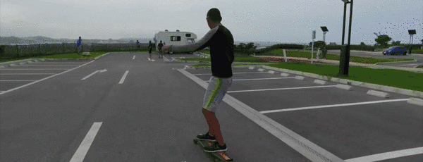

H o k k a i d o

On the first day of the new year, Yas sent me photos he had just taken with his phone in Hokkaido. "Yue," he wrote, "Happy New Year."

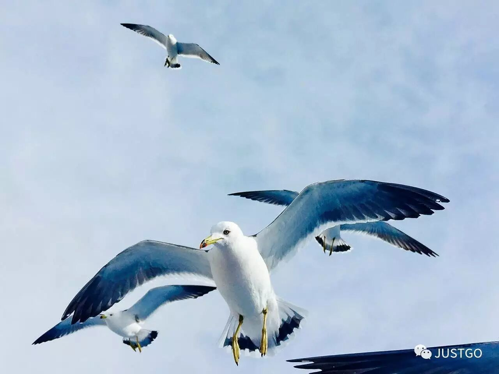

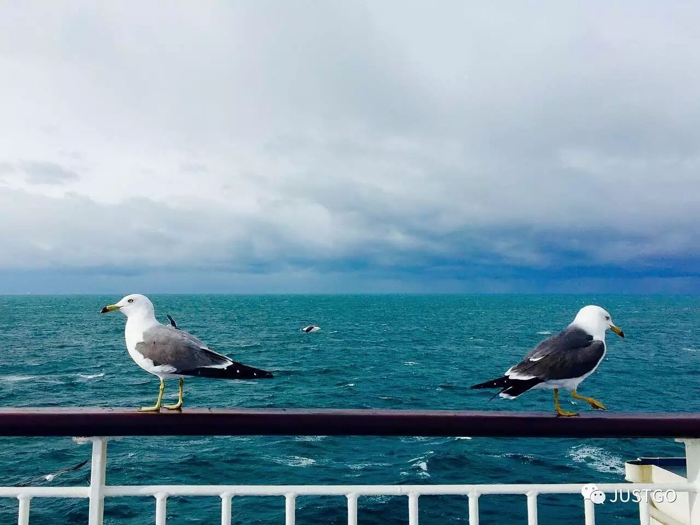

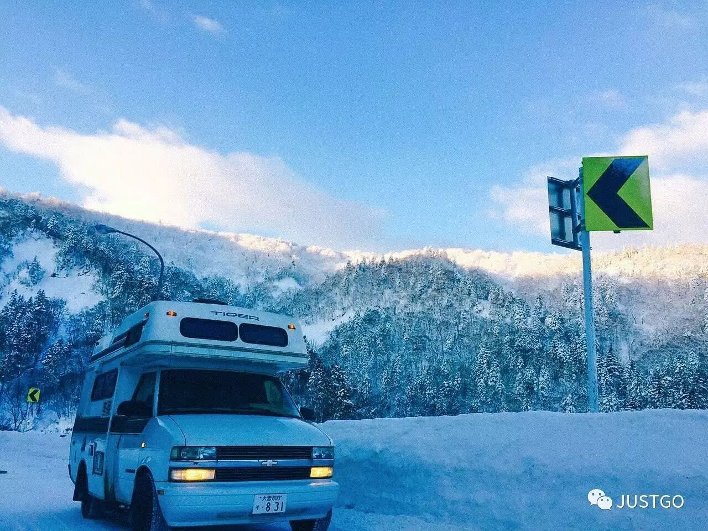

So beautiful.

Yas was my Airbnb host in Okinawa, Japan, earlier this year.

This is his story.

I went to Okinawa this June because of a lucky plane ticket I won. My best friend Yanan and I impulsively set off on a spontaneous trip, dreaming of turquoise seas, islands, and white lighthouses.

On every journey, I look forward as much to the people I will meet as to the scenery I will see. When I go somewhere new, I might skip the itinerary entirely, but I always choose where I stay with great care. I opened the Airbnb website, started browsing interesting listings, and discovered an RV.

The host's name was Watanabe Yas. During the day, he would drive you around, taking you to explore Okinawa. At night, you would sleep in the RV, as if it were your home. This Airbnb was unique, incredibly affordable, and I was immediately smitten.

I started messaging Yas to discuss the itinerary. He replied with one line: "Don't make any plans. Don't ask me any questions. Just come. First, you have to trust me."

How cool was that! It spared me the effort of preparing a travel guide. I packed my bags and got on the plane, ready to embark on a journey entirely unknown, to place my trust in a Superhost I had never met.

**A "Veteran Driver" with a Story**

At seven in the morning, Yas appeared before us with his white RV, exactly as it looked in the photos.

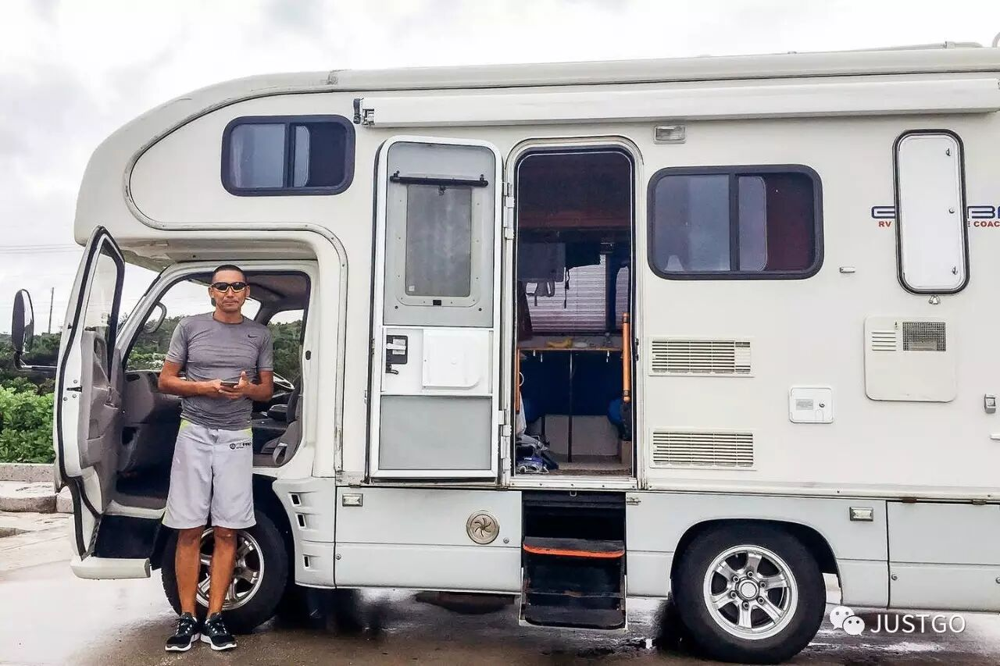

The RV was like a magical box of functions: a sofa, two beds, a dining table, a kitchen, a bathroom, a washing machine, a hot shower... Every inch of space was cleverly used and kept immaculately clean. In Japan, where transportation costs are notoriously high, choosing this kind of RV travel through Airbnb was a real bargain.

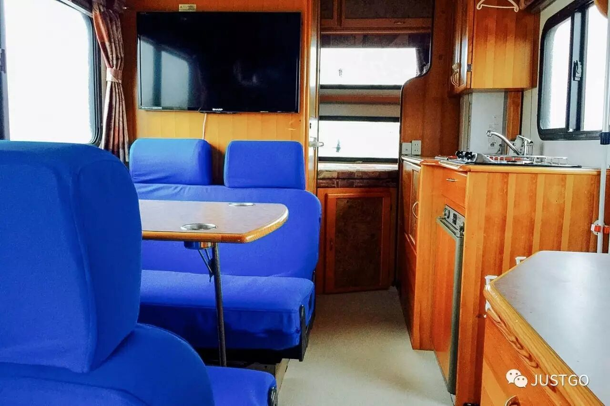

The RV started moving, and our journey began! Yas told us his story. He used to have a stable job in Tokyo, but he kept asking himself what his heart truly desired: he no longer wanted the nine-to-five grind, working just to make a living.

He wanted to be a traveler. He had been to Tibet, Shanghai, and quite a few cities in Europe. He wanted to keep exploring, to see a different world. So he resolutely quit his job, sold his car in the city, bought this RV, and moved to Okinawa, determined to start a completely new life.

He drove alone for a while, and one day it struck him: why not try Airbnb as a way of life? So he drove his RV and began meeting travelers from all over the world: families, graduating students on trips, backpackers... He received an overwhelming number of glowing reviews. The wandering soul became a Superhost, and to this day he remains the only RV Airbnb host in all of Japan.

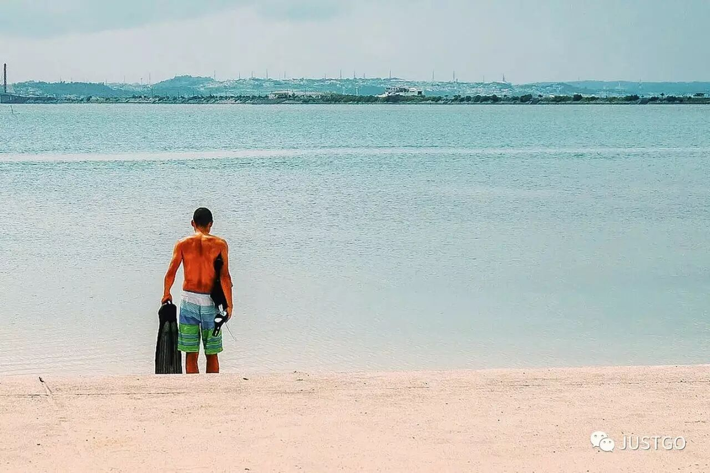

We introduced ourselves to Yas. I am a travel photographer from China. I have stayed in some wonderful and beautiful homes, worked as a journalist, and interviewed and photographed people with stories to tell.

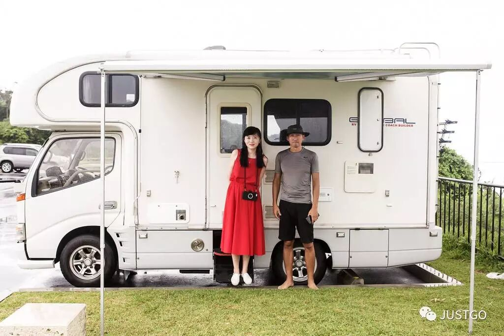

**"I'll Take You on a Secret Route"**

When we woke up the next morning, the first thing we saw through the window was the flowing green landscape outside. This was "home is wherever you roam" made real. We still had no idea where we were going that day. Yas told us he had his own secret routes, roads he had discovered day by day, little by little, as he drove freely and curiously.

He had been to every scenic spot in Okinawa and had memorized the exact time of day when each was least crowded. He wanted to share that beauty with his guests at its purest.

We arrived at a white lighthouse at the tip of the cape. "I finally saw the white lighthouse, the blue sea calm and still, and the journey began to sparkle."

Next, we drove to a deserted beach scattered with driftwood, where he began searching the ground. Hidden in the sand were countless hermit crabs, hilariously playing dead.

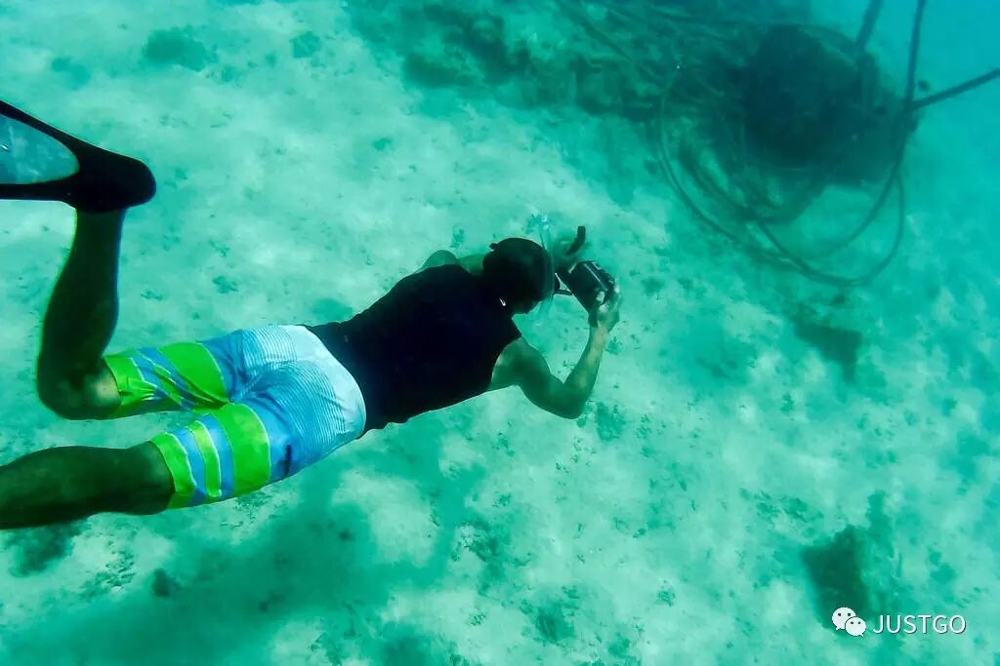

It rained from time to time along the way, as we drove past vast sunflower fields, forests, and coastal roads.

The seawater was so clear you could see the clouds drifting across its surface.

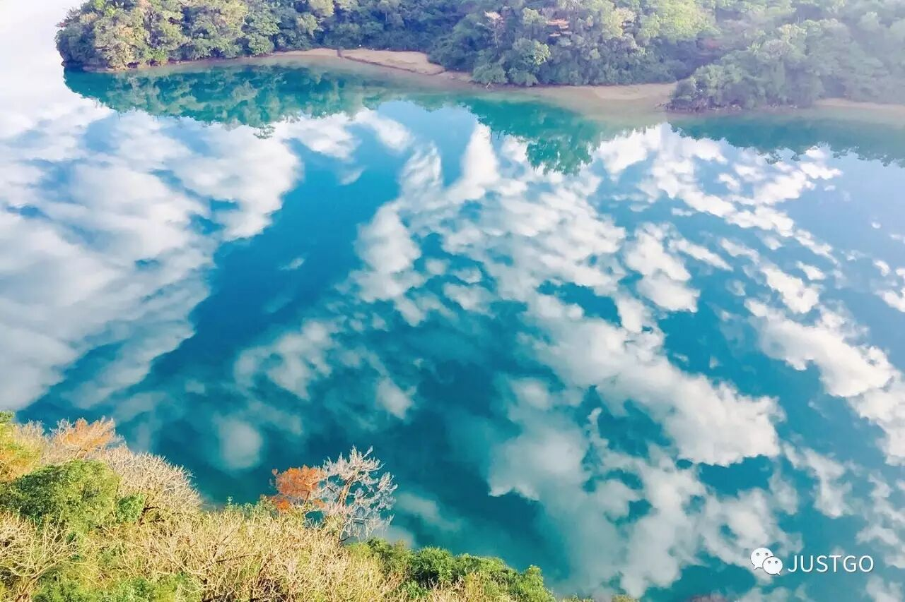

This was his favorite hot spring in Okinawa. He would come here alone and sit quietly for an entire afternoon.

**"Let Me Take You for Authentic, Exquisite Japanese Food"**

Yas took us to the morning fish market for fresh sashimi. We had delicious eel and giant lobster!

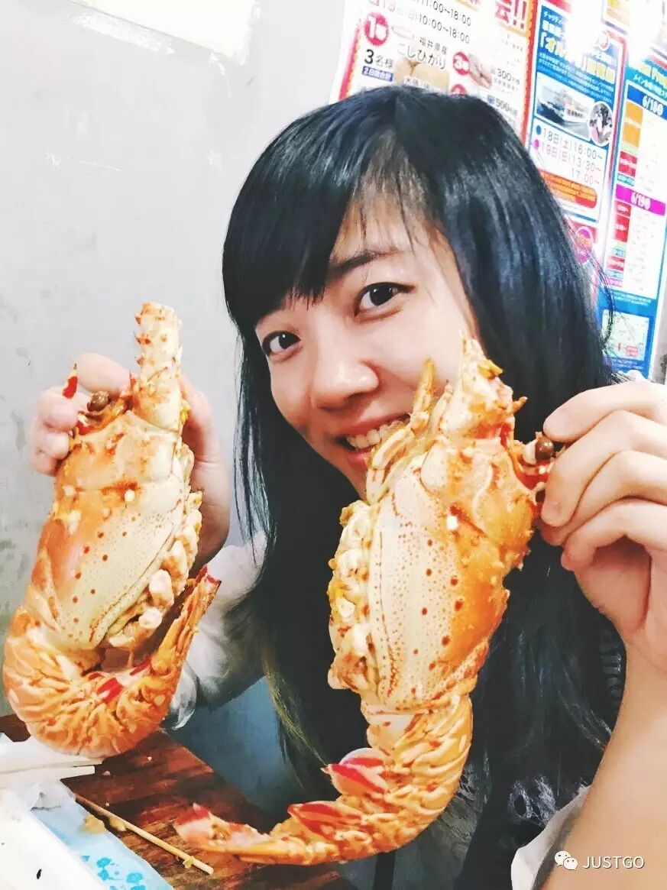

For dinner, he took us to a local eatery. We sat cross-legged on tatami mats, savoring sashimi, fish soup, and sushi, accompanied by cups of warm sake. This authentic, exquisite dinner cost only about 300 yuan. (Our previous dinners had each cost around a thousand.)

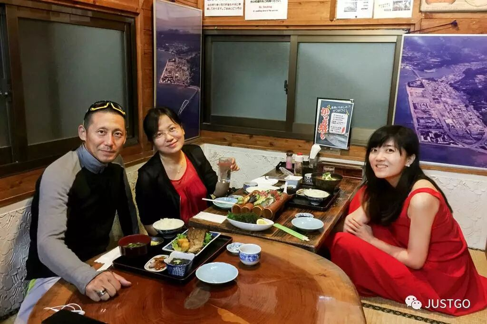

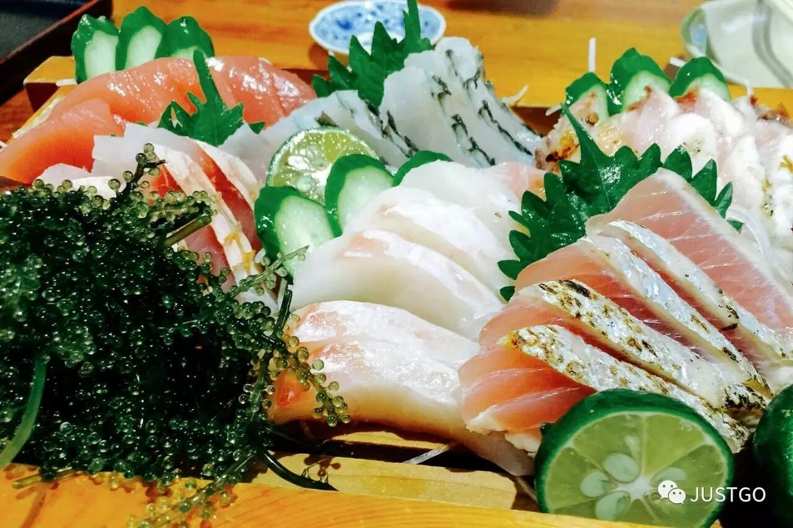

On summer nights, a seaside barbecue is Okinawans' favorite coastal activity. Yas often fires up the grill for his guests.

**We Said Goodbye in the Most Beautiful Sunset**

At dusk, Yas took us to see the most beautiful sunset in Okinawa. The sea, bathed in golden twilight, was as beautiful as a dream.

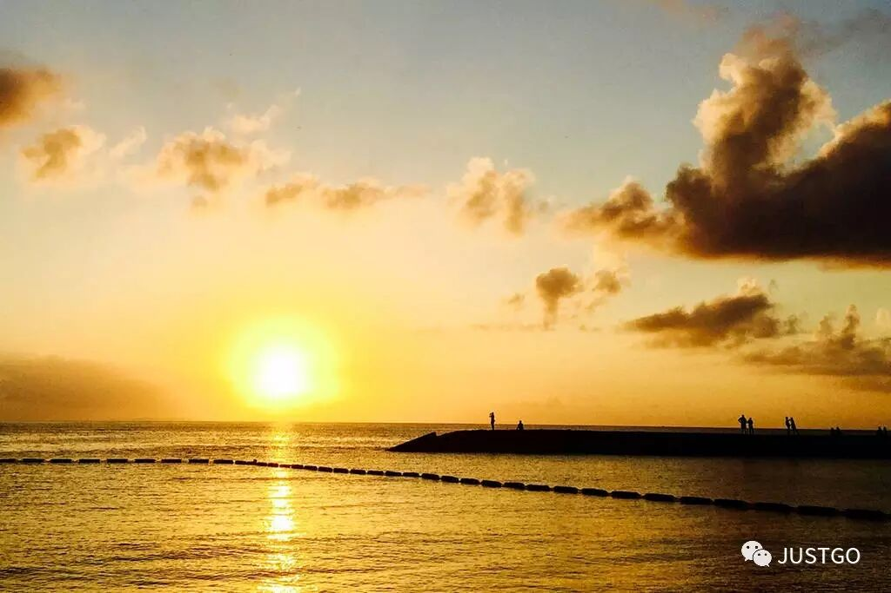

Finally, we drove near the airport. I watched the distant lights of planes flying toward us.

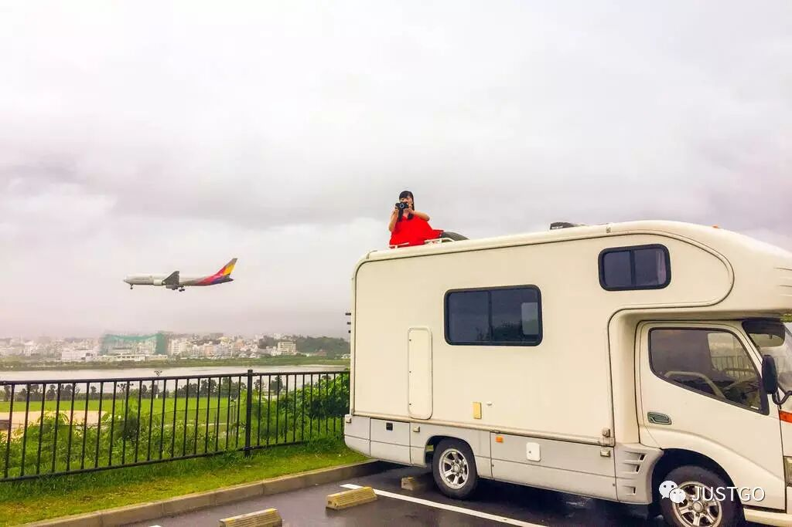

It turned out that from this hilltop, you could overlook the entire island, and enormous military fighter jets would roar right overhead. This was his favorite secret spot. And it was here that we said goodbye.

In Okinawa, I fulfilled my summer wish: to gaze at the sea, feel the breeze, dive beneath the waves, and dream in the endless blue. But what made it truly special was staying in Japan's only RV Airbnb and becoming friends with the coolest host, Yas. We promised to meet again next summer and explore Hokkaido in his new RV. This incredibly cool experience is a gift from the journey. And I will keep going.