# My First Travel Video Story: 3×24 Hours with a Vienna Host

*Geng Yue · Boutique Stays*

This is the first complete travel video I ever made. Director, cinematographer, editor, subtitles, soundtrack — all me. And I was the subject, too.

You will see my awkwardness, and my sincerity.

**A Necessary Clarification**

Before you read this beautiful story, I want to say something. I spent a great deal of time on this piece, and I also suffered real harm. After publishing it on a certain platform, I was unexpectedly met with vicious personal attacks, slander, and even lewd insinuations.

So let me swear an oath: if I have had any relationship whatsoever — beyond that of a guest and an ordinary friend — with this male host in Vienna, or with any of the Airbnb hosts I have stayed with, may my entire family perish, may I be struck by a car, may I go blind and never see a beautiful landscape again. I will accept the most vicious curse without hesitation.

Yes. My conscience is utterly clear.

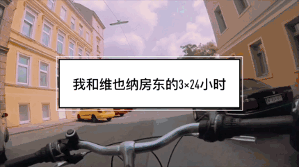

**Because of one house and one host, I fell in love with a city I was visiting for the very first time.**

This is my story with Keke, my Airbnb host. Over 3×24 hours in Vienna, we explored the city together every day. It was as if, in a strange and unfamiliar Vienna, I had found a familiar friend.

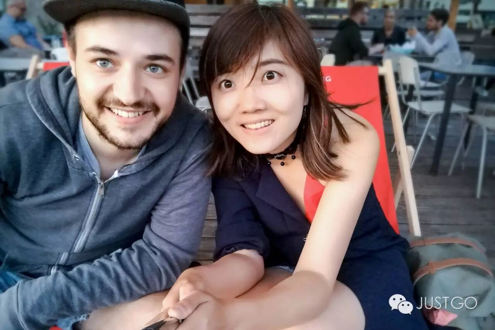

My favorite film, **Before Sunrise**, takes place in Vienna — the meeting of the two leads happens right here. Though I did not find romance in this romantic city, I did find a host who felt like an old friend from the moment we met, and with whom conversation flowed effortlessly.

If someone were to ask me what the best travel experience I have ever had in Vienna was like, I would tell them it was exactly like this. **There were so many moments when I felt as though I truly lived here.**

**"I Want to Meet the Most Fascinating People in the World"**

On the first evening, Keke and I strolled along the Danube, watching the river flow gently by, the lights gradually brightening one by one.

I thought of the film, where Jesse and Celine walked just as casually along the riverbank, and happened upon a poet who looked like a wanderer,

who improvised a short verse: "Just embrace life, as streams ultimately flow into rivers..."

Keke told me about his original dream and motivation for becoming a host:

"I want to meet fascinating people from all over the world. Host and guest **experiencing, exploring together, having exhilarating conversations, sharing fresh experiences...** So that a traveler arriving for the first time can meet a local who knows this city best, and feel as though they have a home in a foreign land."

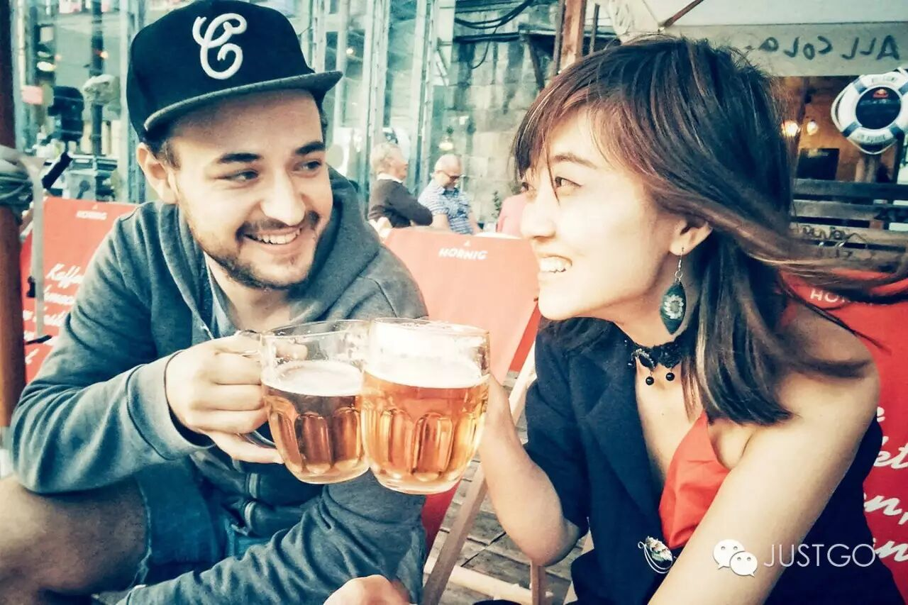

I was deeply stirred. I had booked this place on a whim during a rainstorm, never expecting to encounter a Superhost! **"The right time, the right place — let's toast by the Danube."**

**An Artsy Girl Goes on an Art Binge in the Capital of Art**

The theme of this day was art. "I tailor my recommendations to each person's character and interests. You're a photographer — the best thing for you is to see exhibitions, to see original photographic prints!" We went to the Belvedere to see the original of Klimt's "The Kiss," Vienna's most famous painting, and along the way we saw many masterpieces by renowned artists.

**Keke's girlfriend Cathi** works here, and she specially arranged VIP access for me, making me the only photographer in the entire museum allowed to take photos! I lost myself in a dreamlike world of shimmering gold.

Keke said, "Let me take you to another place a seasoned artsy soul would love." We went to the famously artistic 7th District, where the streets were lined with distinctive little shops and artisan craft stalls — it was absolutely my scene.

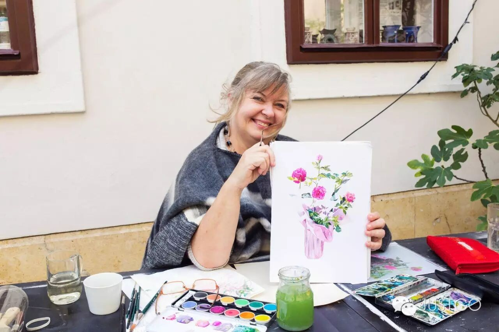

All kinds of creative trinkets and small goods, most of them handmade. The artisans told us the stories behind their creations. An entire afternoon of browsing wasn't enough.

**Eat Where the Locals Eat**

I had made a list of must-try foods, and number one on the list was the national dish — schnitzel! Keke took me to his most recommended garden restaurant, free of tourist crowds and incredibly good value.

The best way to understand Vienna is to linger in its coffeehouses.

**"If I'm not in a coffeehouse, I'm on my way to one."**

— Austrian poet Peter Altenberg

On a sunny afternoon, Keke took me to the oldest coffeehouse on the Ringstrasse, a shop that opened its doors in 1861.

We drank the house signature coffee and ate Austrian pastries. In no hurry at all, we sat there chatting the entire afternoon. I discovered that "old Viennese" will spend hours in a coffeehouse — chatting, working, reading the newspaper...

**For Those Who Love Life, the Kitchen Is Always Warm and Bustling**

Carrying fresh ingredients we had bought at the market, we decided to have dinner at home. I took the opportunity to learn Keke's signature pasta dish. While the pasta was cooking, we talked about why he loved Vienna so much. He said:

"The city I want to settle in must have no foul air, no pollution. It must have extremely convenient city facilities, the best cultural atmosphere, and music. There is pressure in life everywhere, of course, but here you have healthy food, the freedom to breathe, and a good way of living. This city is perfect for young people full of vitality, especially students."

After hearing this, my love for Vienna grew even more! Keke's pasta was superb. It turned out that an Italian guest had once stayed with him and taught him the authentic recipe and hometown secrets of Italian pasta.

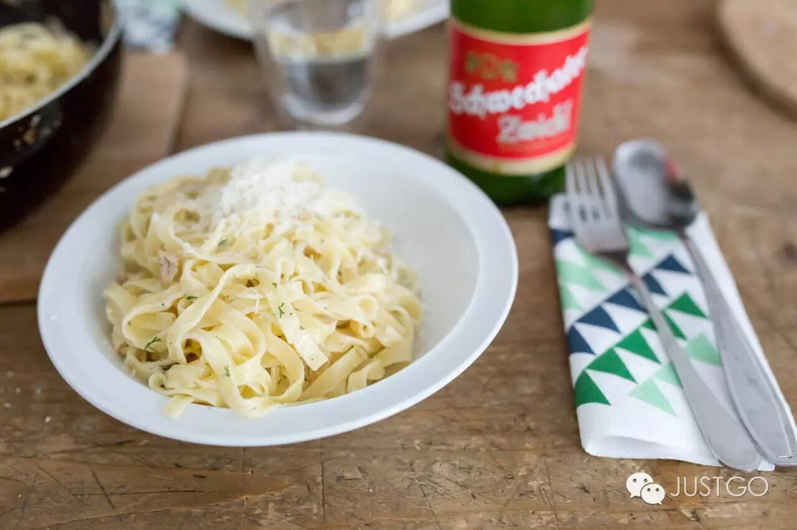

After dinner, Keke invited his close friends over for drinks and conversation. Their club meetings — he would invite me to join too. As we talked, we suddenly discovered that we were both Airbnb Superhosts. Astonished and delighted, we excitedly shared the marvelous experiences we had each had as hosts.

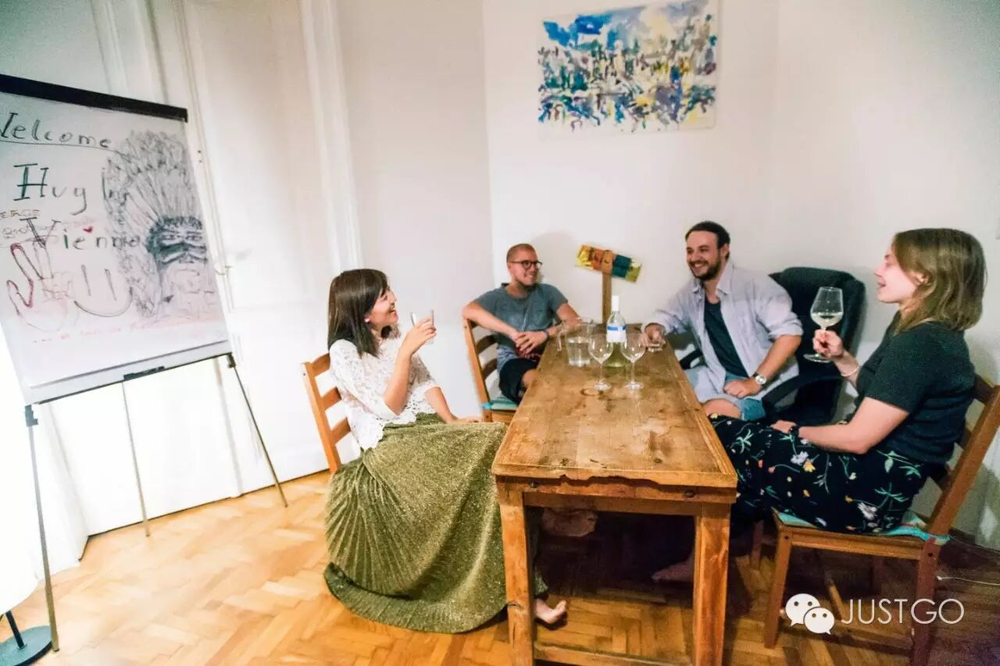

**Falling in Love with the Warmth of Everyday Life**

The next day, Keke's longtime friend came to visit him. The three of us went to the most famous local market, Naschmarkt, wandering through the vibrant, colorful market, buying local fruits, vegetables, and spices.

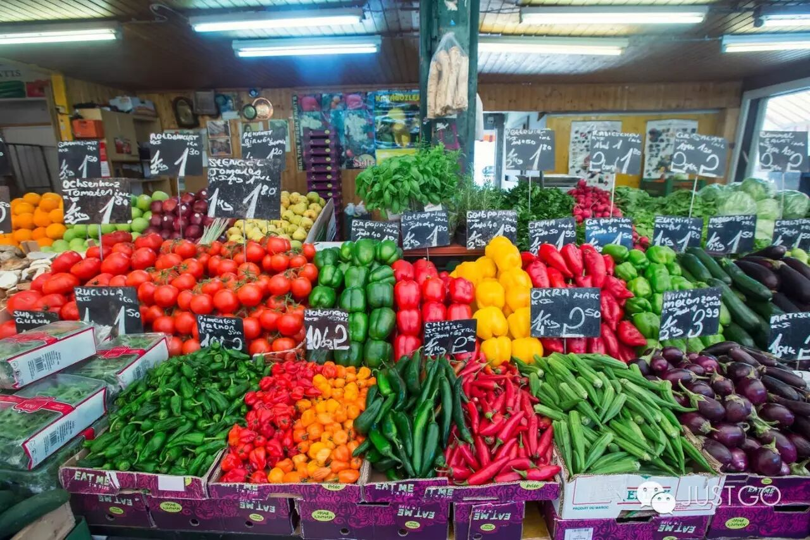

Along the way, he enthusiastically shared little tips: you can walk and sample snacks handed to you by the vendors at 120 stalls, but the moment you stop, you'll need to buy something. I moved through the market freely, like a local... watching Viennese people drinking beside traditional wooden wine barrels.

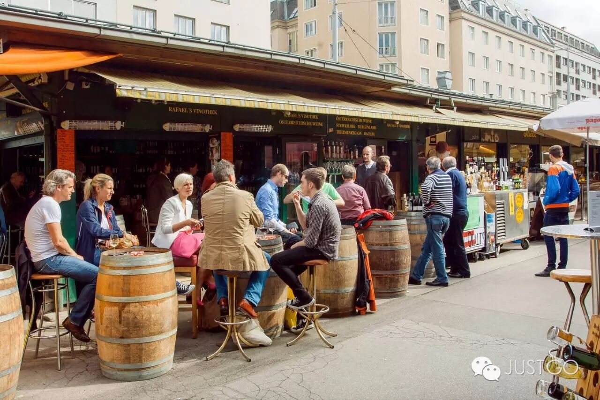

When we got tired, we sat down at a roadside restaurant, eating salad and talking about the delightful moments of market browsing.

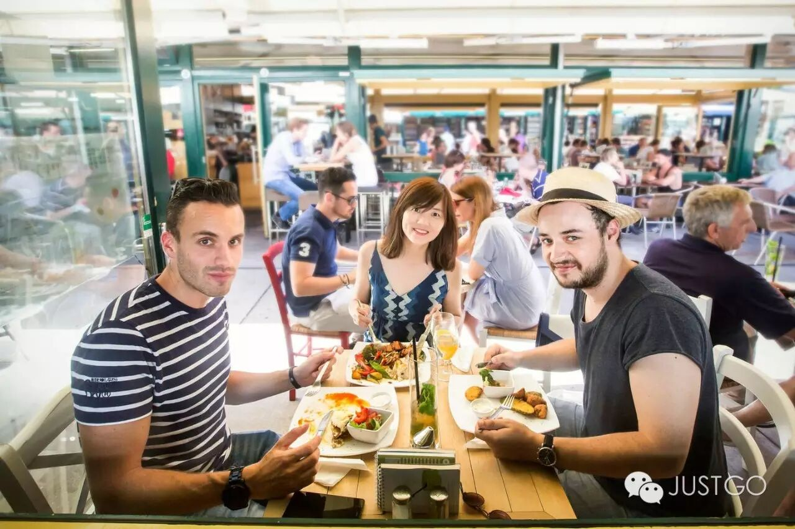

**So Slow, So Beautiful**

We sat beneath towering, lush trees, on reclining chairs on the lawn, savoring the small joys of travel — eating ice cream, every bite a taste of wonderful Vienna.

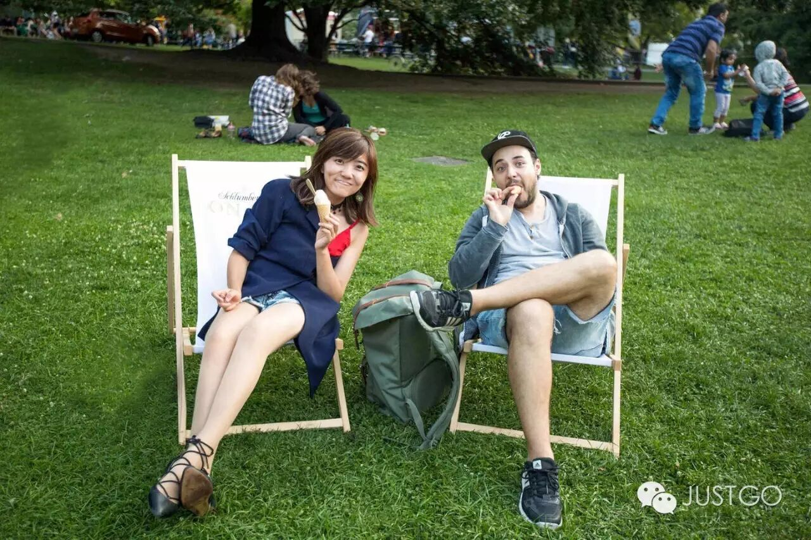

In the park, with sunlight and music flowing around me, I once again saw how the people of this city live leisurely and at ease: picnicking on the grass, skateboarding, having drinks, playing with children... Life is so slow, and so beautiful.

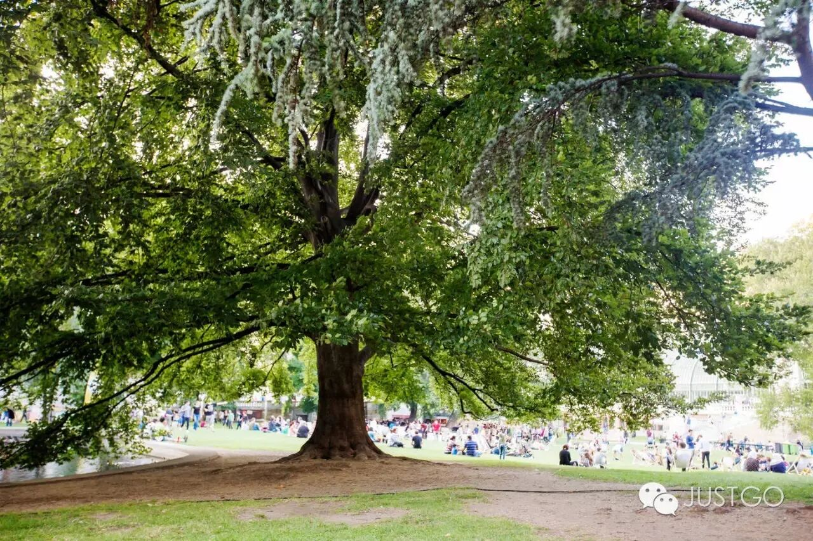

Keke's place is called "Hug Inn Vienna." When we said goodbye, we shared a big hug.

Everything we experienced together was one embrace after another of this unfamiliar city. In the end, a city is just a distant point on a map.

**But it is the encounters between people, the connections, the stories that unfold, the trust that is given**, that make a city soft, joyful, and radiant —

that infuse your memories with a gentle, everyday warmth, and truly settle into your heart.

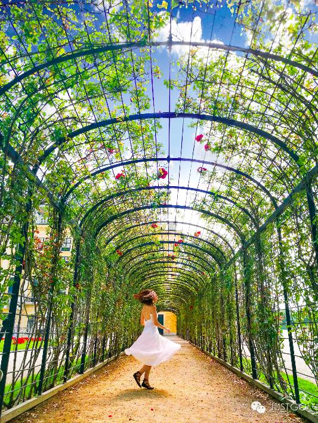