# Prague Boat House: Every Encounter Is a Gift, the Power of Going Deep

*Geng Yue · Boutique Stays*

Greetings to every friend who opens this article.

During the days I haven't updated, my energy and state of mind have been very good. Thank you for your concern.

When I am immersed in life, I ask myself: what is the **most irreplaceable meaning** of publishing these updates?

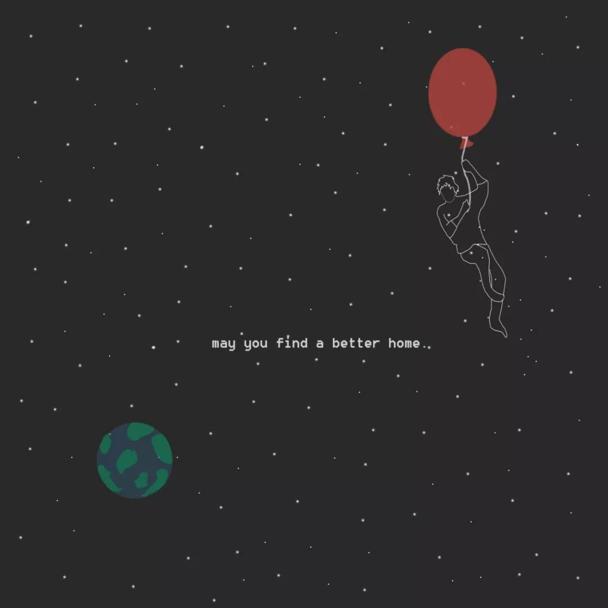

Why do I persist for no apparent reason, willingly and wholeheartedly, instead of turning to something else to cultivate and create?

Perhaps it is about seeing what value my passions and skills can bring.

It is about recording the exchange and transmission of energy along the path of growth — the moments of being moved, the joy, the things that shine, the refusal to give up.

It is about serendipitous encounters. **It is about, amidst the vast sea of people, finding a particular energy that I alone cherish.**

It is about attracting kindred spirits. It is precious resonance. It is seeing yourself in someone else. It is ignition, growing together.

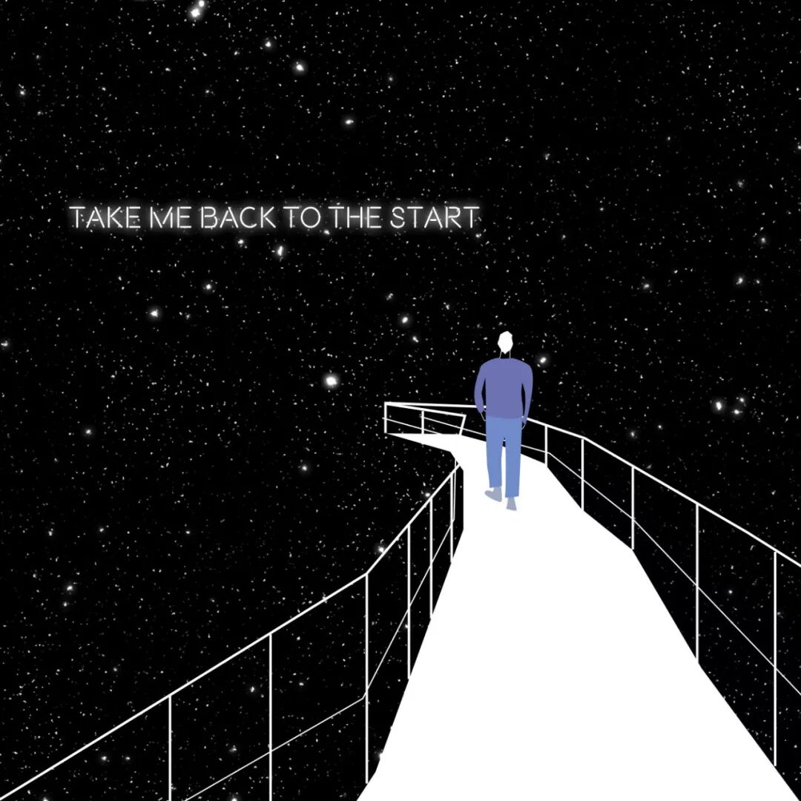

I have also been thinking about what I originally wanted to share when I started JUSTGO.

At the very beginning, I kept a low profile and had no desire to write my own story at all.

I wanted to record the stories of my wild, wonderful friends.

To glimpse a more beautiful and expansive world.

I see the draft from before the launch:

*There truly is a group of people in this world*

*who dare to live the life you don't dare to live,*

*they live outside the norm, yet their lives are immensely brilliant.*

*Read one story every day,*

*each story a wonderful little planet brimming with energy.*

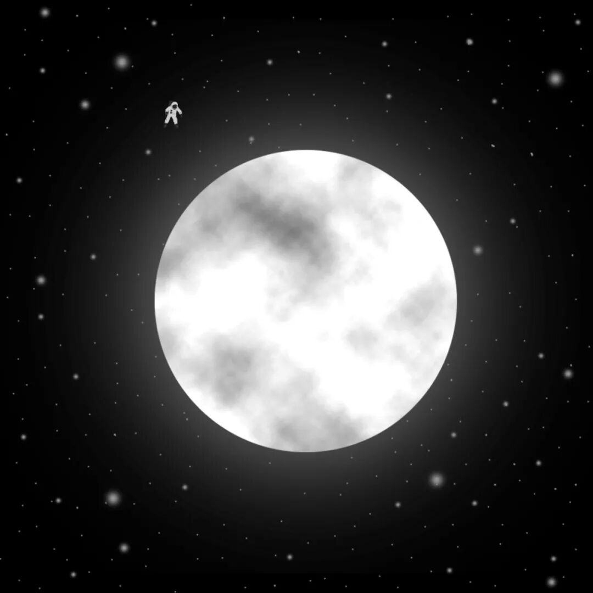

I want the act of reading to feel like trading lives.

Connecting with wondrous people from every corner of the world,

taking their good energy, their cool lives,

and letting it fall into your world like a fleck of starlight,

passing on to you strength, love, beauty, and faith.

It is the fleeting treasures of the journey,

the collection of luminous moments,

to fight against the days when things are not going well, when your battery is low,

to illuminate the gray, rainy, unhappy times.

I set my sights high. The execution hasn't been as ideal. I've been willful and emotional.

There have even been moments when I thought about giving up.

But one cannot have walked so long that one forgets why one set out in the first place.

**I still remember.**

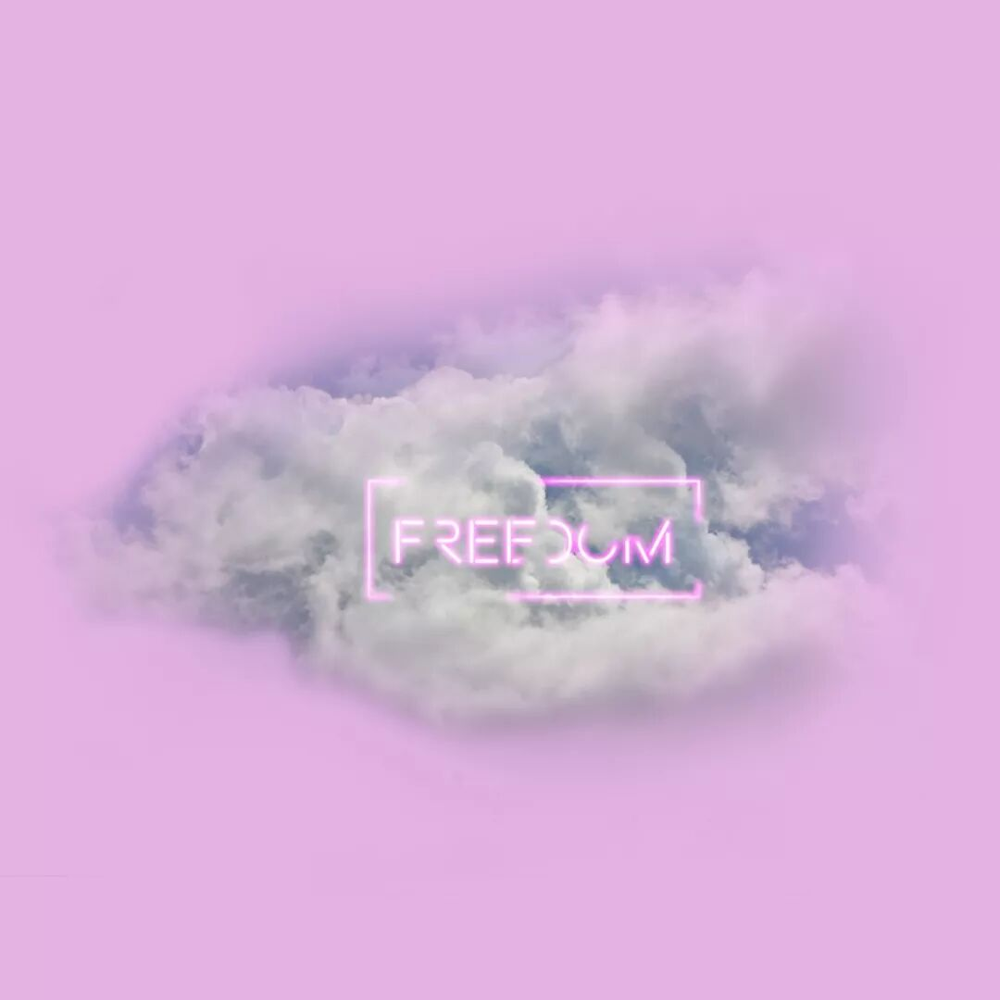

Today I want to share a story about a boat house in Prague.

It is a kind of life exchange.

*Illustrations by Maham.K.*

**Prague. I stayed in a house floating on water, and walked across Charles Bridge nine times**

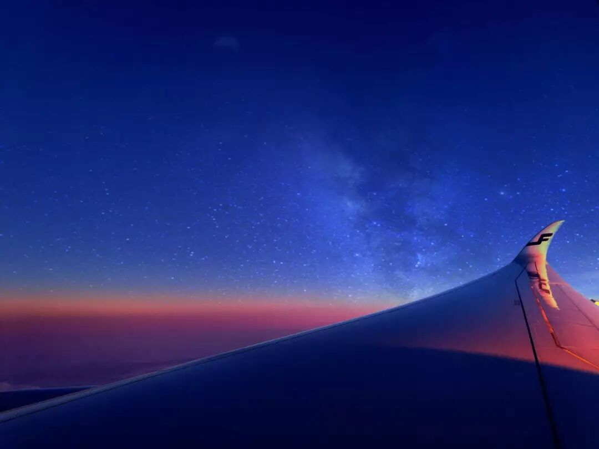

When I fly from city to city around the world, each new city feels like opening a gift box.

Every house I stay in feels like being in another world entirely.

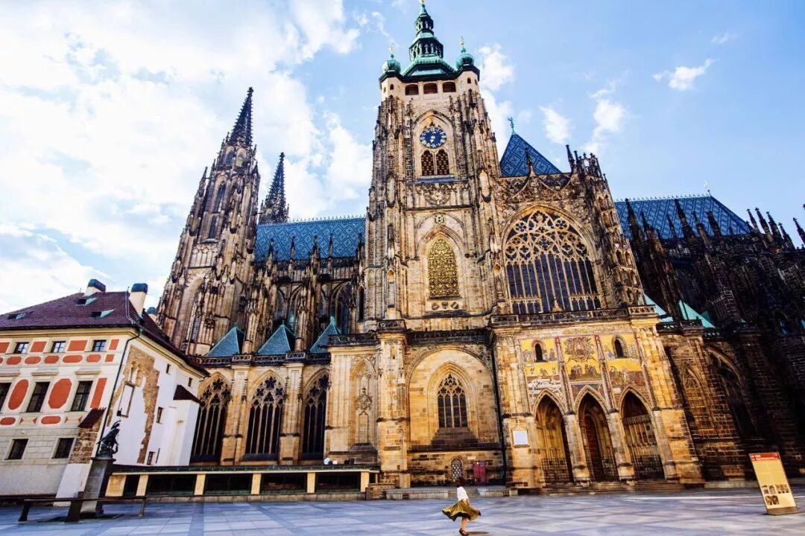

**Staying in a Boat House Floating on Water**

When I learned that in Prague I would be staying in a boat house floating on the water, the entire journey began to sparkle.

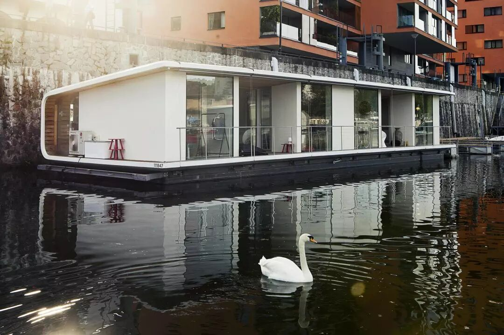

My host Lucas came to pick me up by car, and we stopped in front of a white boat house.

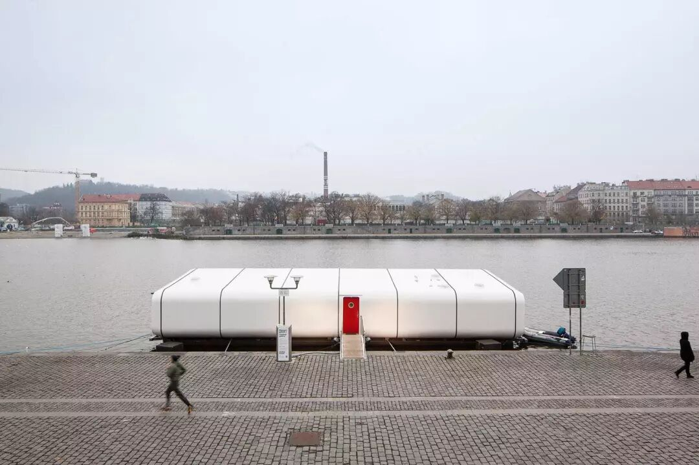

Before opening the door, he said, **"This is a new world."**

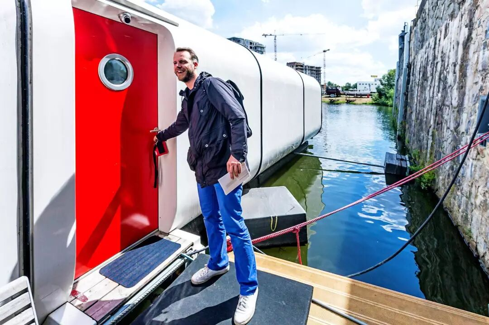

This **house built on water can move** —

"It can move to any place in the world you love. You love mountains, waters, small towns... you can go anywhere!"

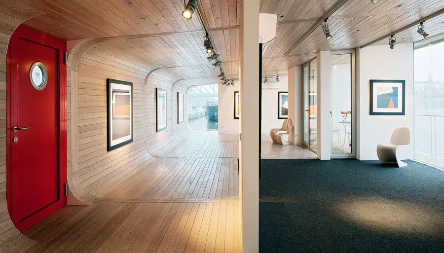

Wooden walls, streamlined curves, minimalist modern style.

The space is very spacious. You can instantly transform four rooms into five, six, seven, or eight, switching configurations to suit everyone's needs.

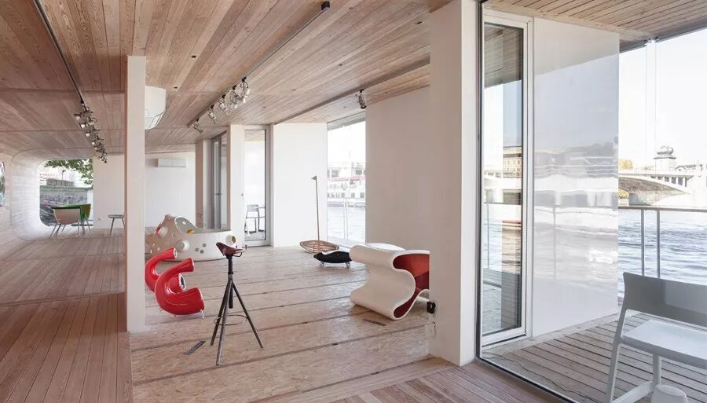

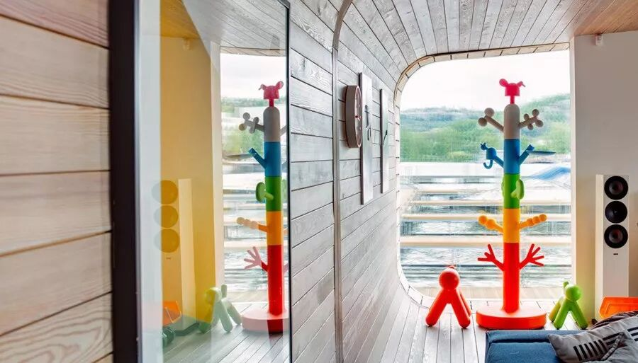

A boat house is a mobile home, with a bedroom, study, living room, kitchen, dining room, bathroom, and more — fully equipped in every way!

Before you, large floor-to-ceiling windows and vast open areas. The entire boat house is filled with sunlight, with a panoramic river view.

I couldn't stop playing with the high-tech furniture. The entire house is a smart system controlled through a mobile phone. "**It feels like stepping into outer space.** "

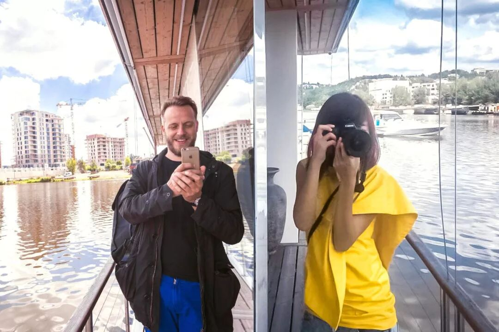

When my mind is weighed down by work, music flows, I sip coffee, and my mood settles into calm.

It is so quiet here. I sat in this chair for quite a long time, the breeze so pleasant.

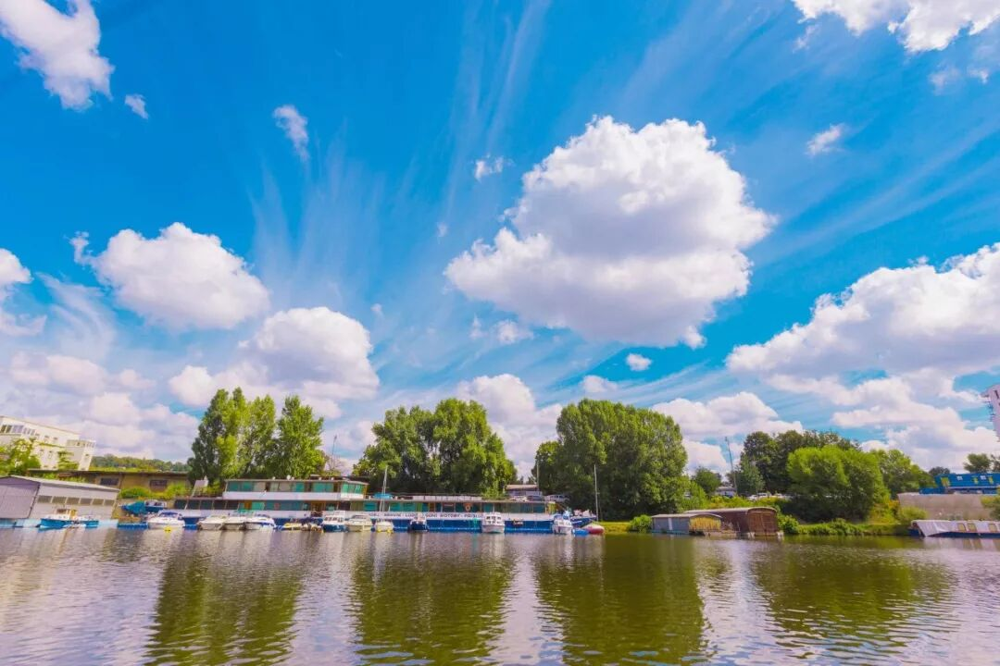

**A Firm Belief in the Existence of a Beautiful Way of Life**

My host Lucas has lived in Prague for nearly twenty years — studying, graduating, marrying, having children, founding an advertising agency.

He showed me the Airbnb logo tattooed on his arm. He is quite fond of Airbnb's spirit of sharing. He also wants to help homeless elderly people in Prague find shelter, and hopes to turn this possibility into a charitable project someday.

He quite admired my work and lifestyle, and set aside an entire day to drive me around Prague.

As we drove, we talked. He is incredibly interesting, smart, and witty in conversation. Though already a mature company founder, his sincerity and patience with his guests was deeply moving.

Why he settled in Prague, why he can't leave Prague — **he told me the whole story, bit by bit:**

His childhood from beginning to end, his family, high school, entrance exams,

every entrepreneurial venture, his happy marriage and children,

the balance between work and life, every adventure yet to be realized...

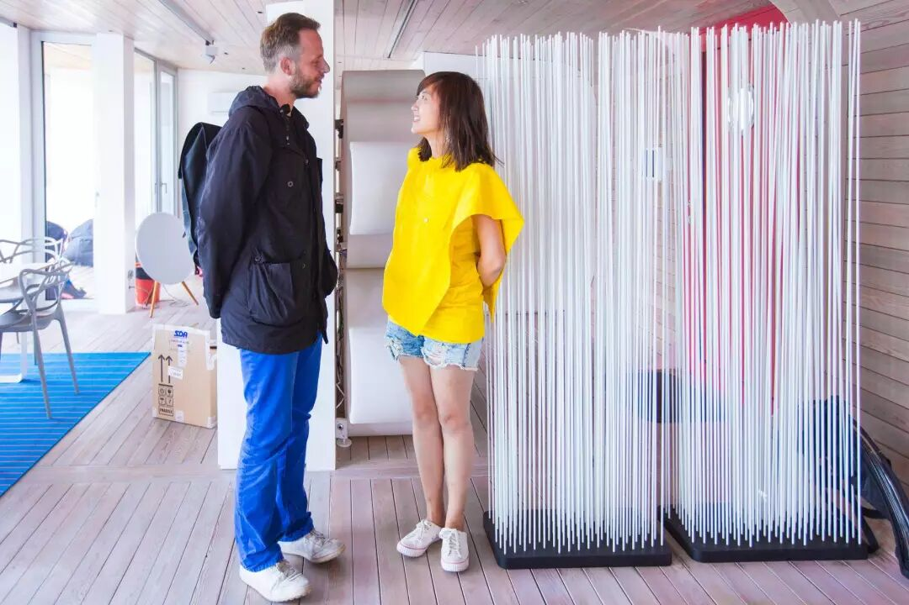

Lucas is a romantic and idealistic man of action.

In his youth, on a meadow reminiscent of Woodstock, he once set up an open-air cinema,

watching people be moved, laugh, and cry in the midnight hours...

**"Strangers, in a special place and time, sharing a brief, sincere memory — how beautiful that is."**

The expression on his face as he recalled this while driving past that meadow — I still remember it now.

The exquisite design of this boat house is a creation he built together with his wife Hana.

Collaborating with the finest architects, they brought it from nothing into existence in just half a year — a testament that makes you believe in the existence of this beautiful way of life.

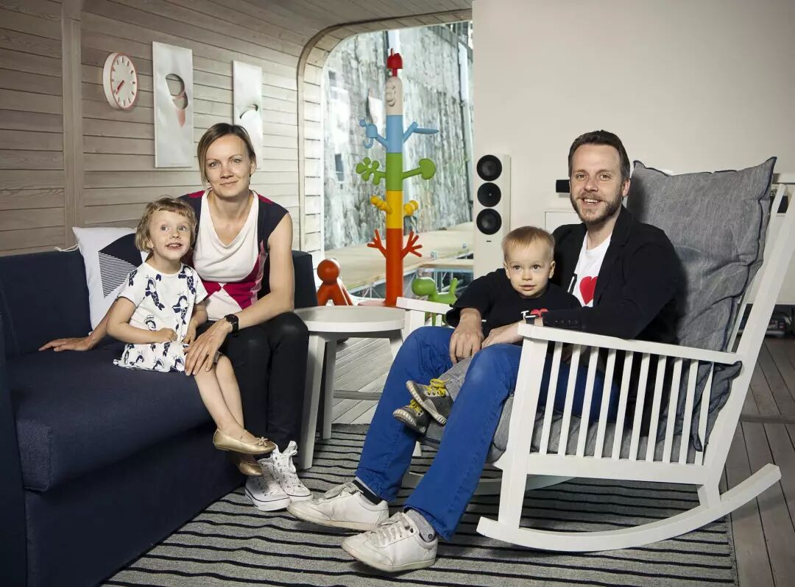

This is a lovely family. They have a beautiful son and daughter, and toys are placed in the rooms too.

They invited me over to visit, to join their parties, and shared funny stories about their children — we laughed nonstop.

**Walking Charles Bridge Nine Times**

I wanted to visit Charles Bridge. They said, "Why not try walking Charles Bridge nine times? Only then can you say you've truly been to Prague."

The boat house is on the river, but it takes only ten minutes to reach the city center. When I had walked back and forth nine times, I realized that every time, the scenery was different.

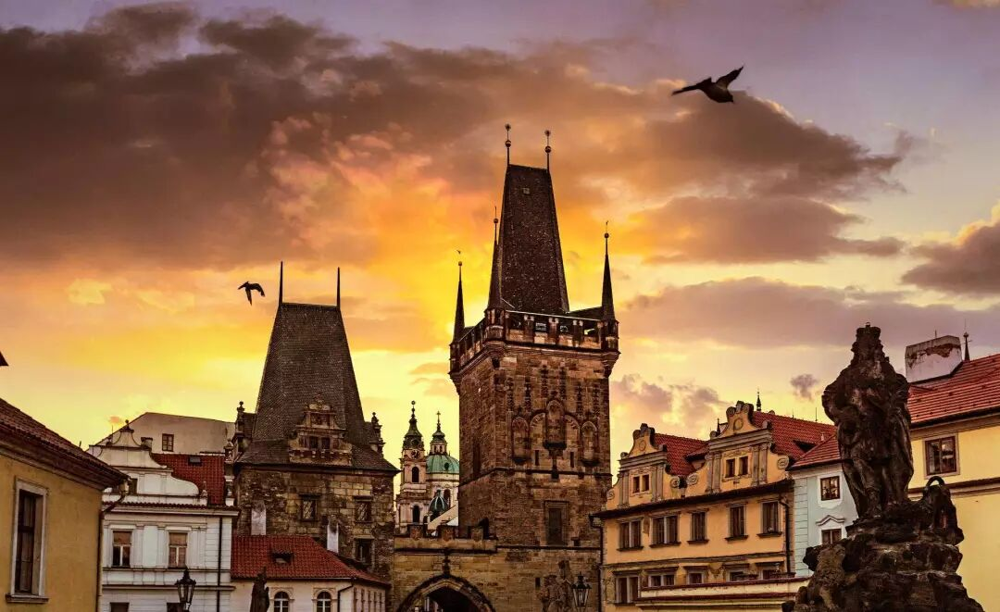

This, "the most beautiful bridge in Europe," sits upon the shimmering Vltava River.

"Charles Bridge presents an uncanny skylight, a vast swath of orange-red, fire-like clouds flickering on the other side of the bridge.

The bridge body and its standing statues are black, steeped in the smoke and dust of ages. Some statues have been moved into museums, yet the replicas that replaced them appear as ancient as the ancient originals..."

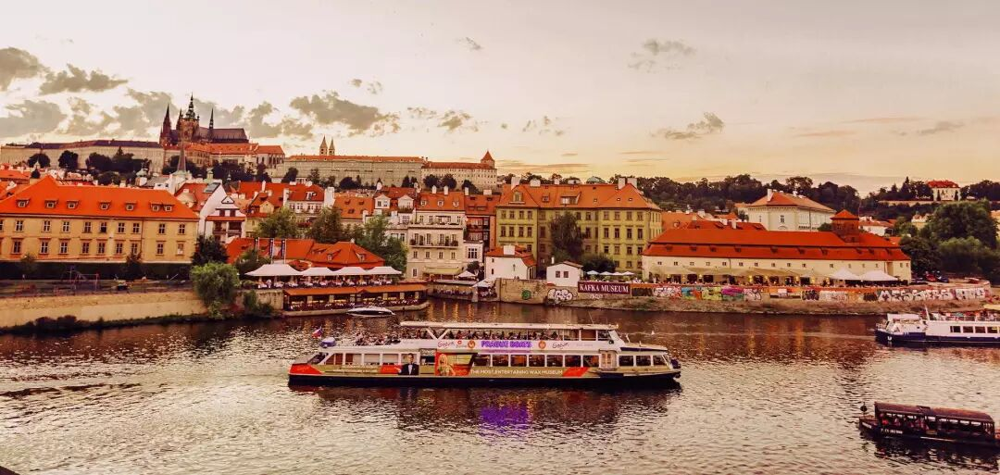

"I love to row my little boat upstream along the Vltava, then lie back in the boat and drift downstream, admiring the different bridges..."

Kafka once wrote this in a letter to his lover Milena. The castle, the bridge, the old town — together they form a complete Prague.

Crossing the bridge at dusk, the light illuminated the old town in a warm glow.

On the bridge: tourists, performers, passersby, vendors, musicians — like a small, spontaneous art salon.

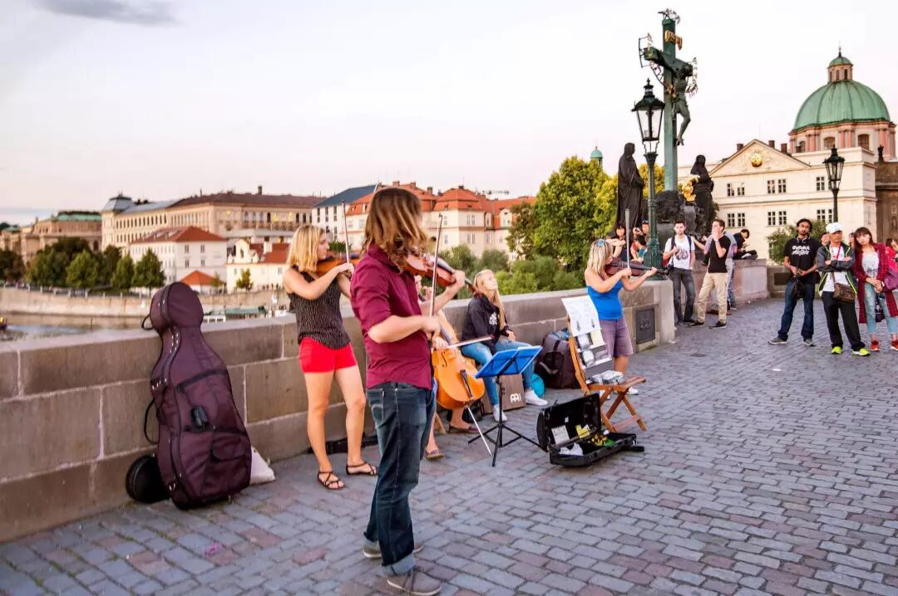

This bridge has always been an inexhaustible source of inspiration for artists, photographers, and poets.

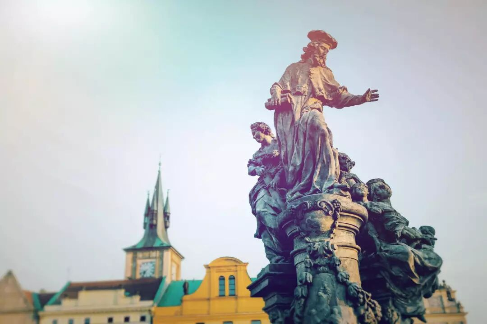

I gradually began to sense the weight of over 650 years of history. The bridge has been submerged by raging floods, scorched by Nazi fire — and now, here you are, walking gently across it.

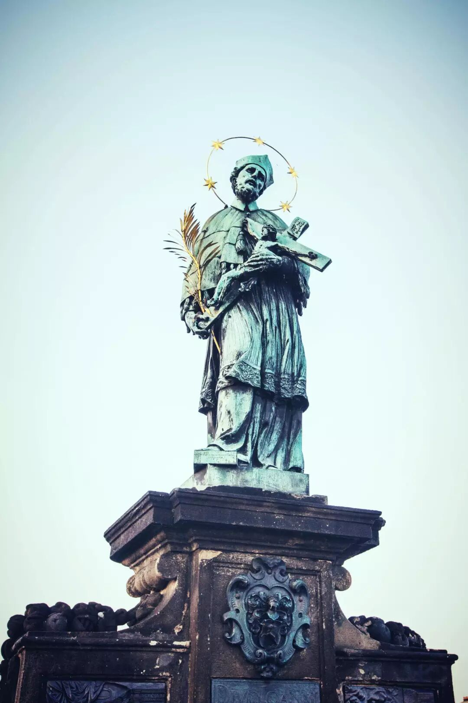

**Exploring the Locals' Prague**

My host took me out for a stroll. At a street-corner cafe, we happened to run into a photographer friend of his. We sat down right there for a drink, talking about music and travel.

The photographer showed me his documentary project on music concerts, which he had just shot in India, Brazil, and elsewhere. The black-and-white retro footage was impossibly cool. I said to my host, "**Your friend is a pretty cool, rare creature too.** "

Lucas recommended a Prague guidebook written by a local, covering all the best places to explore, play, and eat.

"You can understand how locals live, the neighborhoods they live in, where to find the best restaurants, bookstores, and cafes, where the most interesting theater is."

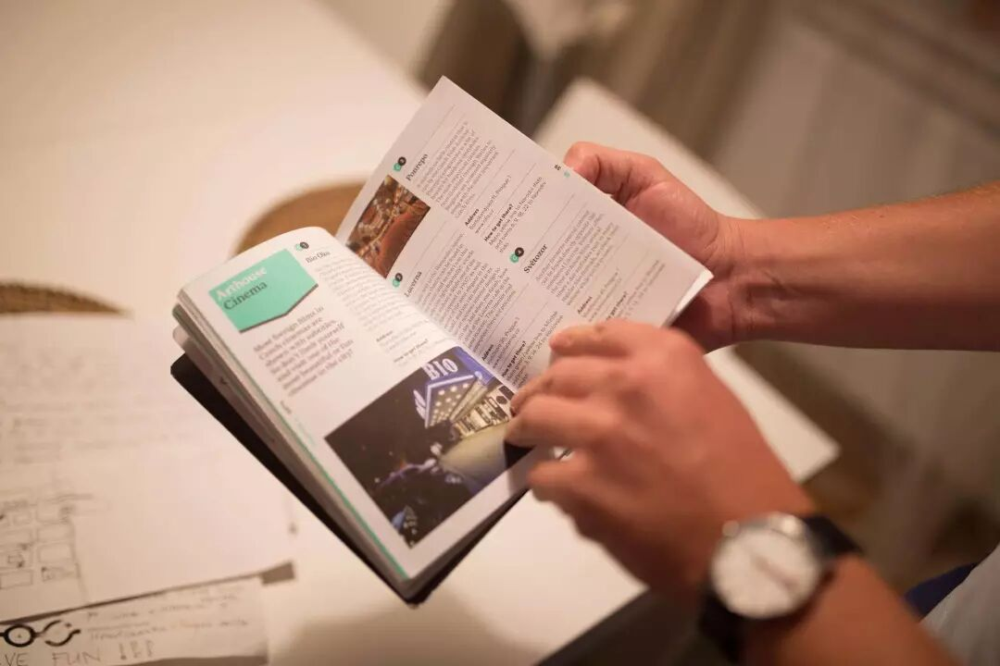

This little guidebook later proved tremendously helpful during my solo explorations of Prague.

On the day we explored Prague together, we went to his favorite cafe for brunch. He said, "My diet is very healthy, combined with regular exercise and sleep.

So even though I have hundreds of things to handle every day, plus two kids to raise, several Airbnb listings to manage, and many friends to see, I can still manage to be full of energy."

He also opened a treasured artist's album and told me from which angle Prague looks most beautiful, and where you can take the best photos.

After that, I took these "treasures" and explored the city on my own.

I met a little boy playing with bubbles in the square.

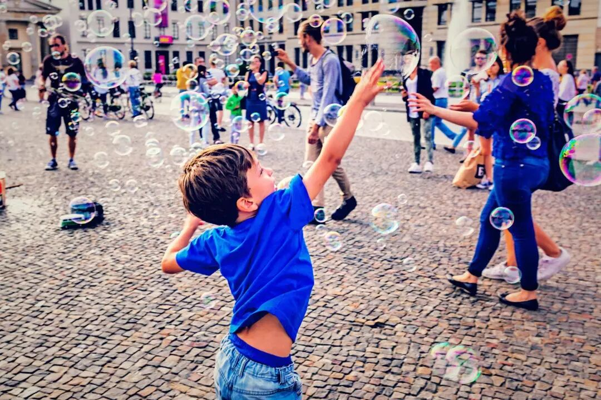

I ate the sweetest raspberry ice cream.

I went to the castle district to see the golden church and beautiful architecture.

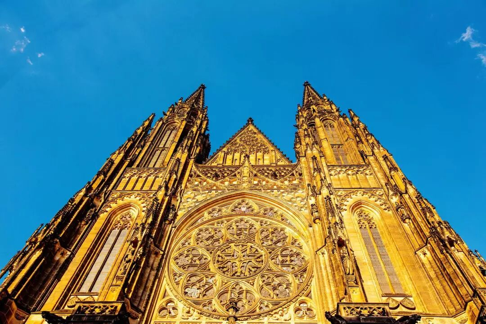

I listened to the astronomical clock chime on the hour, the wooden puppets singing.

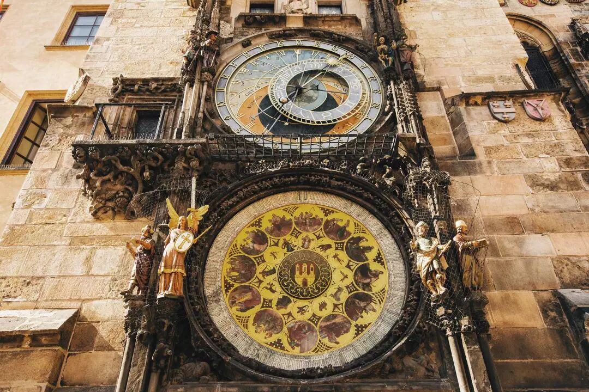

I climbed to the highest point in the city and saw the entire expanse of red rooftops.

I went to graffiti the John Lennon Wall, then to a pub to listen to "Yellow Submarine" and have a drink.

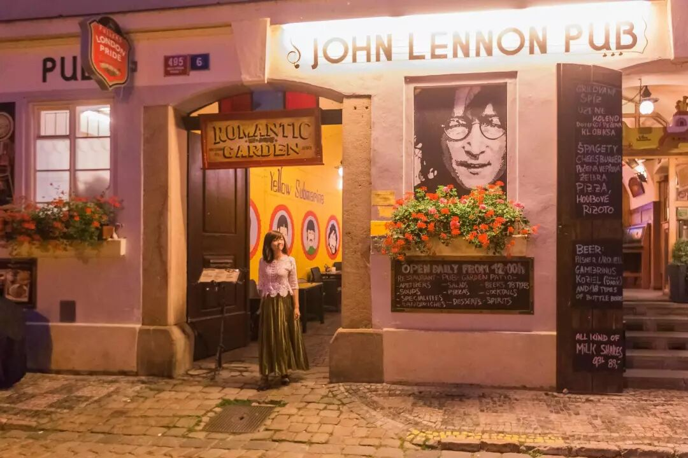

I sat in Old Town Square, where someone was singing, someone playing the violin, someone performing with fire — and I ate handmade ice cream.

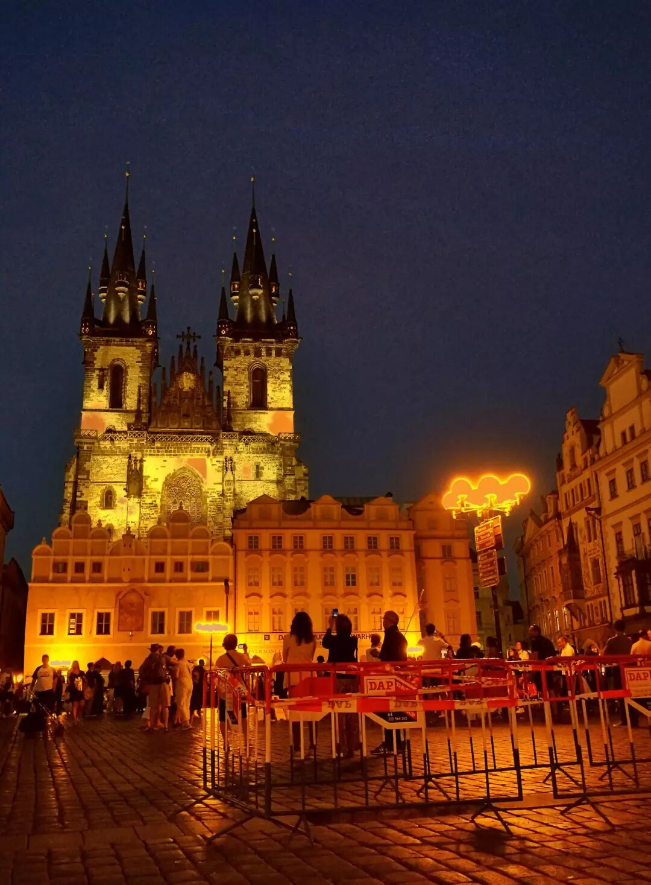

As I left, the boat house's warm yellow lights glowed brightly.

The new traveler who stays here will fall asleep to the sound of flowing water, be woken by swans, gaze at the shimmering river outside the window, and lose themselves in a life that feels like poetry.

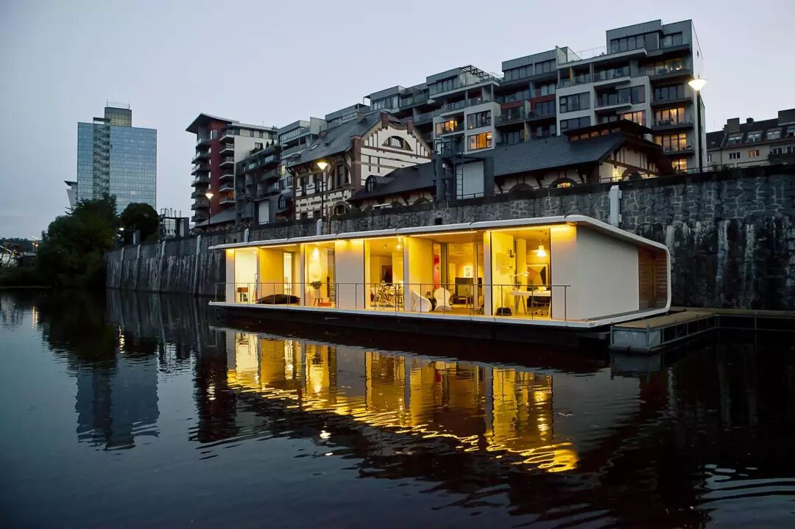

I packed away this chapter of memories and began my next flight.

"As long as I have a plane, as long as the sky is still there, I will keep flying."

I opened a book and saw this line by Beryl Markham. People from all over the world, flying tens of thousands of kilometers, countless different lives — meeting because of one house, blooming with a different kind of radiance.

I love this so much. I will never tire of it.

**Photography / Interview / Writing by Yue**

We all live in a yellow submarine. When we want to go deep, we dive beneath the surface, beneath the water.

When we want to rise, **we ride the wind and waves, sailing it toward the sun.**

The submarine has its own pace.

Even when the outside world is raging with storms, we remain calm and unruffled. It is not about cutting ourselves off from the world, but about "being ourselves" in this chaotic era.

What matters is finding the rhythm that suits your own life.

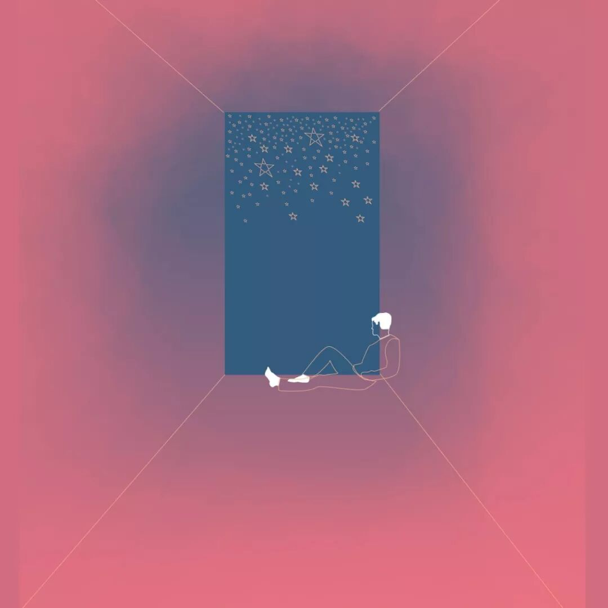