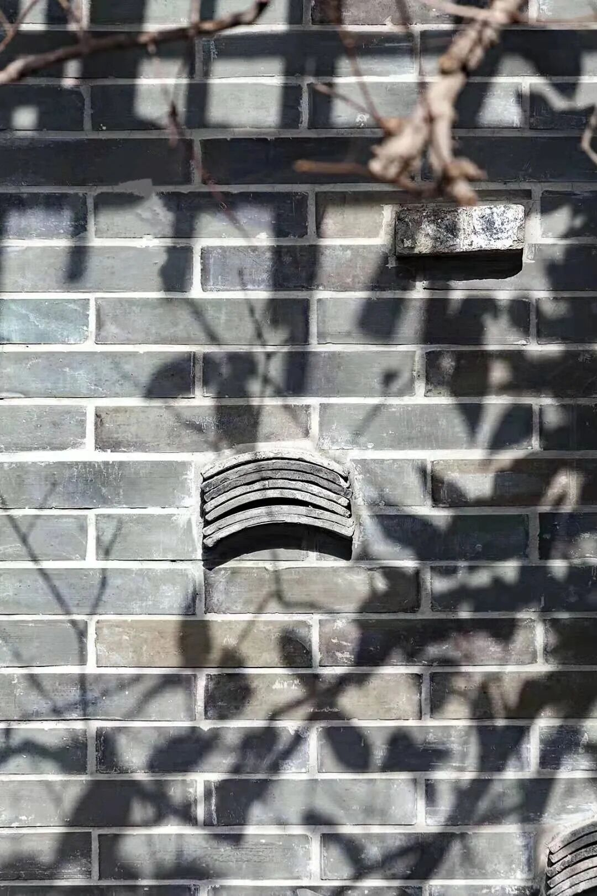
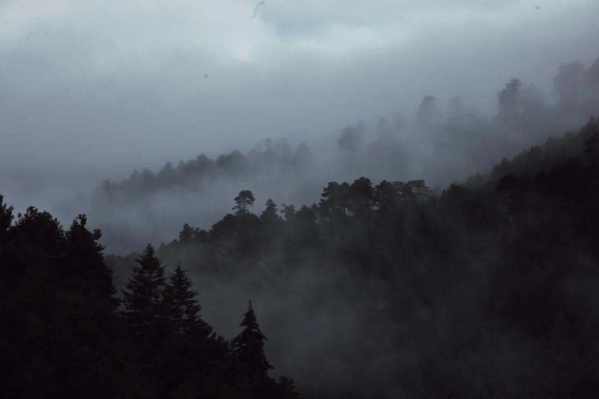
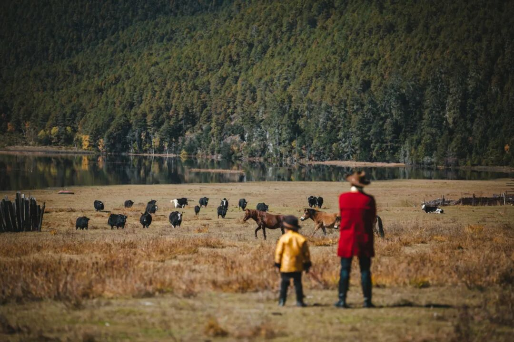
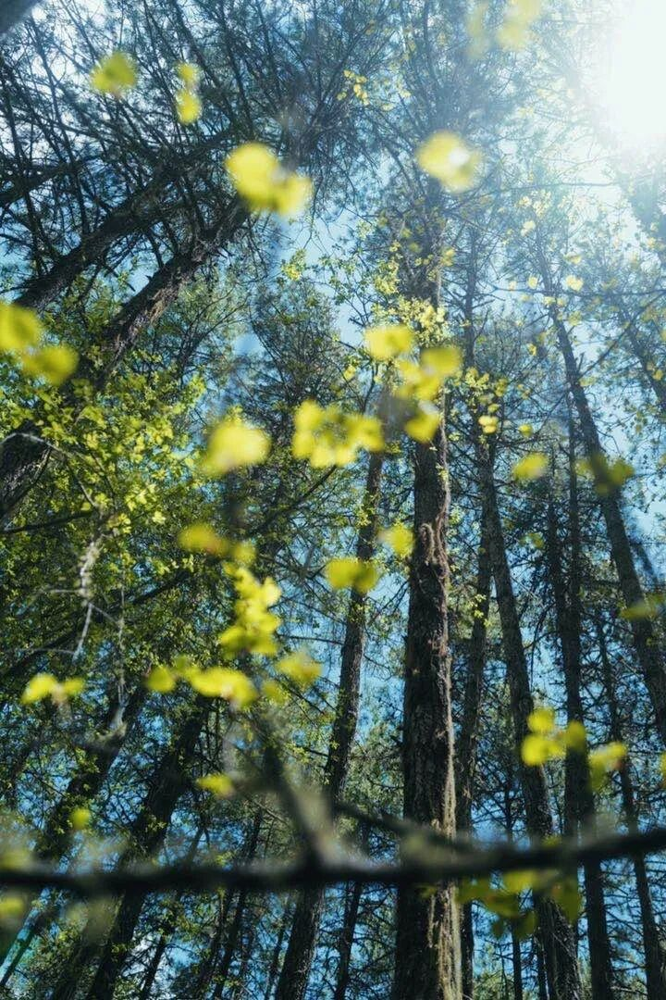
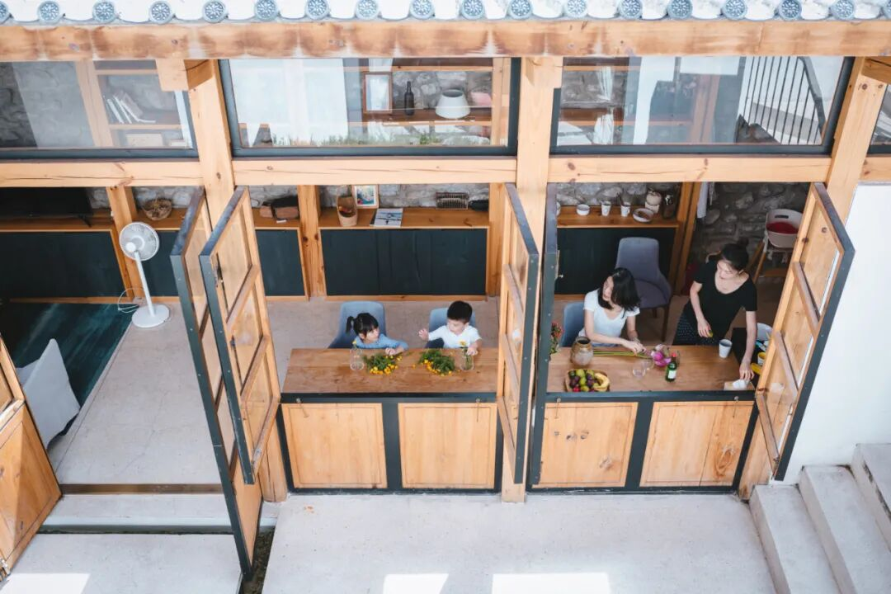
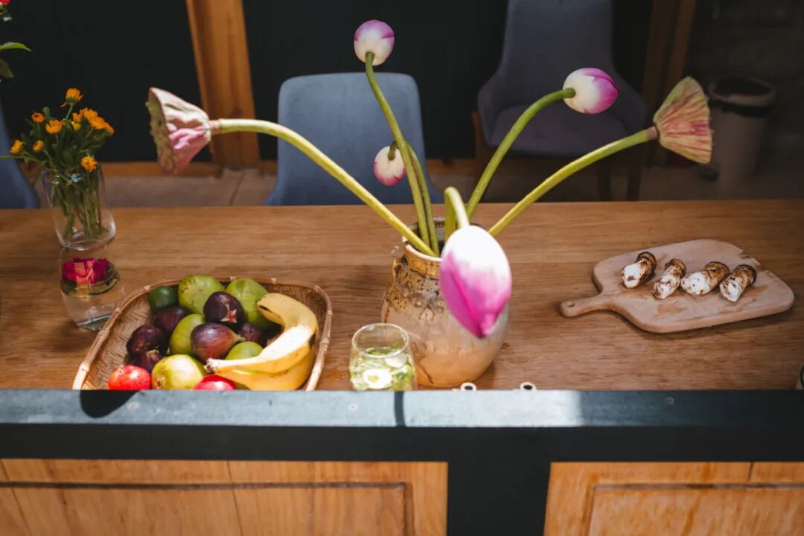
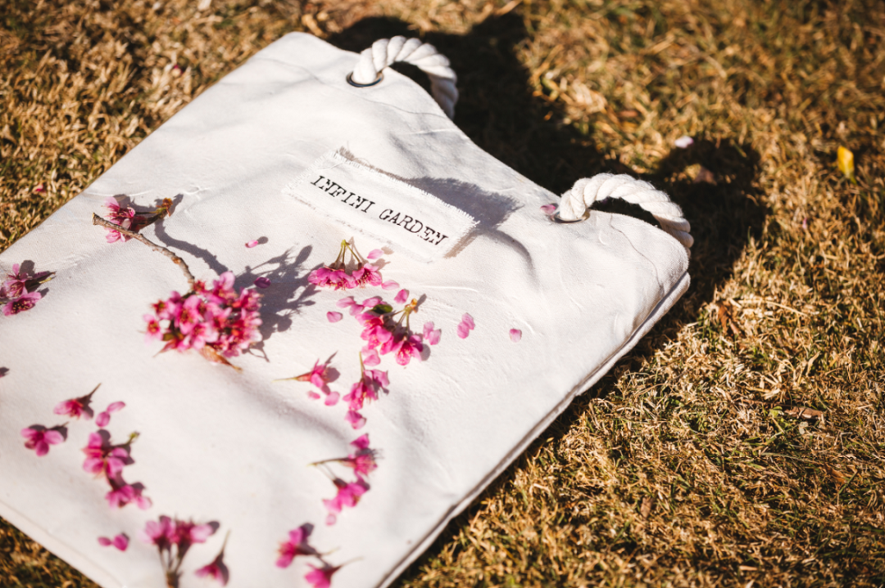

# 感官之旅：开启感官的奇妙旅程

*Geng Yue · Boutique Stays*

感官为何动人？

知觉的英文名Sentient来自拉丁文，sentire，意思是感觉，其词源是印欧语系的sent-，意思是「前往」，「去」「心思欲去」。因此知觉意为我们有意义，更清楚。完整的意思是我们有感官知觉。

而你久居城市，将自己置于忙碌之中，有一种麻木的踏实，原本灵敏的感官会逐渐变得钝化。

感官是我们了解这个世界最重要的讯息。

你的眼睛，你的耳朵，你触摸的知觉，闻见的气味，品尝的味道，都决定了你接受的世界的讯息，形成了你独一无二的生命。

除了五感，还有第六感：感知世界的能力。

生命本身就是一场奇遇。如果我们能打开感知，去探索这世界不断涌现的美，去体验一场欢愉的心灵盛宴，该多么美妙。乃人间值得。

感官

这个世界感官何其丰富。

「我们常说注重品质、品牌、品味。品字，由三个口字组成。

口，就是味觉。品是一个人从吃开始。我们经常在城市里吃饭匆忙，随便打发一餐，味觉变得混乱。可以慢下来，好好得吃一顿饭，去找回你的味觉可能，因为当味觉越来越麻木之后，其他感官的可能也会流失。」

而你可以闻到美妙的气味，听到美的声音，看到美的事物，可以从一道菜里品尝到美的滋味，这才是体会到了品质。」/蒋勋《品味四讲》

当你走进一个空间里，你会有感官的立体感受。

你需要用自己的身体，去丈量这个空间的尺度感，有的空间你感觉很有舒适感，有的空间就是待不下去，这都是你的感官告诉你的答案。

如果你感受到了空间里的自由呼吸感。

你会喜欢迎面而来的风，目及远处的海。

你触摸到斑驳的墙壁，从而得知旧建筑的故事，体会到了时间沉淀的质感，与过去的时光产生关联。

你看见一个木头做的窗檐，干净质朴，像一个画框。而住进来的旅人，会从这里看见，早晨六点熹微的晨光，晚上八点落日的晚霞，夜里斜晖皎洁的月光。

这是自然的馈赠，也可能是这个房间留给旅人的最宝贵的礼物——记忆。

你可能偶然住进了一个空间，之后那个空间就变成了你记忆里的一部分。你会在世界的某个角落里突然想念它，就仿佛味蕾的复苏一样。你会像想念一道菜一样想念一个房子。

而最终引起我们留恋的是，是特别的视觉记忆、嗅觉记忆，那些感官组成的记忆，会在心里留下的温度。

设计

無舍一直在践行「民宿温度」具象化，保持、提升着质感和细节。

而感官恢复之旅，是我们未来想去尝试的一个升级方向，想去设计一些有差异化的旅行产品。

像「感官转换器」一样，怀抱着美好的期望：尝试让旅人唤醒内在更有潜能的、更有力量的自己。

「史诗人」
 传奇秘境 浮生若梦

居住在自己城市的旅人，注意力专注在日常工作的及时完成，容易在固定不变的人际关系脉络、平时生活的活动范围里重复循环。

而你可以尝试换一种角色，让自己有机会穿越到不同的时空里，不被困在一次人生中。

在無舍的感官恢复之旅中，你可以是「史诗人」，在「秘境旅居」中沉浸体验戏剧化的季节。

故事从你出发的那一刻开始。秘境为天然舞台背景，而你是故事的主角，打卡一些别出心裁的艺术装置，沉浸在传奇的艺术探险之旅中。

你也许可以穿越成一名勇士，一位古人，抛开固化的身份，去接受远古的召唤，去邂逅温柔的花朵，群星的泪滴。

浮生若梦，为欢几何？
人生百年，如白驹过隙。

感官的解放，让旅人从许多牵绊与束缚中解放出来，还原到纯粹的自我。

——  我们会结合自然、文化、艺术、音乐、戏剧等领域，深入去发掘不同目的地的”在地文化“。并将其与感官相通，给你一种创新别致的住宿体验。

灵感

田园旅居

被大自然治愈

在《启程》里，卡夫卡写，“那你知道你的目的地啦？”仆人问要踏上旅途的人。

“知道，”我回答说。“我说过：‘离开这里’，这就是我的目的地。”

移动，是让生命流动。目的地不重要，重要的是离开。

我们想带你一起去走向深山，在田园旅居里生活，被大自然治愈。

在無舍扎西牧场，任何一个拐角，都能触摸到自然。

如果你在一楼，清晨会听到牛群的阵阵铃声；

如果你在二楼，燕子和蝴蝶有时会飞来做客。

当你出门绕着湖泊漫步，会看见日光洒向斑斓万物：湖泊、沼泽、叶片闪着光泽……

当你穿梭在半山腰上，会遇见松树、杜鹃花、狼毒花、秋英、蘑菇和无名的野花……

这里有牛、马、猪、羊、鸡、狗、猫……如果你想钓鱼，也可以在湖边垂钓，来体会藏民“钓到了晚饭吃鱼，钓不到就吃青菜”的质朴生活态度。

你在大城市里的技能反而想不起来用，因为这里与世隔绝，远离商业、工业等现代文明。

只是让感官打开，感受自然的呼吸，让山林、植物、绿色的空气流经你。毛孔被大自然的美浸润。你的感官早已变成大自然的一部分。

那些原本就有的柔软与细腻，会自然苏醒。

夜晚你也可以在草地上扎起帐篷露营，在牧场上围着篝火跳舞，看篝火燃烧的光芒，和扎西家族的朋友们聊天，欢笑。

月光如此皎洁，手可摘星辰。而你就在那最美的画里。

你听不到任何市声，却可以听见内心的声音。

能量

/  葡萄牙文人费尔南多一天从家里返工，经过一道篱笆，从篱笆间的夹缝，他望出去了，见到了一片景色。

他凝视那朵花的美，心生悸动。那一刻，他比任何一个旅人走的都远。/

城市「异乡人」
身未动，但心已远 

在城市里如何做一个异乡人？最关键的是：抽离。

我们会打造「城市旅居」，尝试提供新的陌生视角，帮你从自己习以为常的生活抽离出来。

以前我们心中的旅行，走得越远越好，离开长期所生活的城市才能叫旅行。现在懂了，其实远就是近，境由心生。

不用那么强调距离，而是关乎一颗心，对美的感受力。在生活细节里，感官有触动。

「人的一辈子只有一万多天。人与人的不同在于，你是真的活了一万多天，还是仅仅生活了一天，却重复了一万多次。」

每个人的感官都不同，只有那一刻属于你。

所以有时候旅行完好像重新充了电。如果我们能打开感知系统，会让生活的闪光越来越多。

连接

唤醒五感，唤醒灵魂。

「阳光晒在院落里，投入到房间，每一个光斑都透着愉悦和温暖，这小小的包围，让人那么满足，手中的茶也更香，嘴里的刚从院子里摘下的脆柿更甜。」

这是老K在云南小院子里感受到的一个明媚午后。

我们能感受到细微，从平凡生活里的细节中得到滋养。也因为感知的敏锐，生活会回馈了幸福感。

我们能感受到时空的广阔。一个人的安静呼吸，蝴蝶在花丛里的轻轻振翅，鲸鱼在海洋里低声吟唱……与地球连成一片梦境。

我们会拥有新的视野，也如植物一样，把根系伸向深处，与自己的内在连接。

你也会更加珍惜健康，爱惜自己的身体。更珍贵的是，你那些优秀的品质被激活——平和，清醒，不畏，自信。

为什么这篇文章会出现在你的面前，因为我们当初出发，只是心里的那个声音在说。

我想要不一样的人生。

留言说说你对“感官”的理解
我们将会选择5位赠送
無舍InfiniGarden帆布包或其野香水

后记：

老K曾经写过，电影《Soul 心灵奇旅》中提出了一个问题：

生命中点亮你的火花是什么？那个答案是感知。学会爱和爱上生活里的那些美妙时刻，可能才是此生的意义。

而我们想创造感官故事文旅，必定是选择了一条更难走的路。

需要去挖掘真正打动人心的东西，去捕捉心动灵感，去打磨微妙的体验。

需要更用心，但是很值得。因为足够难，也足够真诚。

Reference 参考内容
老K：無舍、無花果、無往、無季、無所，我一直在逃离设计圈

無舍扎西牧场：在草原上，做一个“偷走风景的人”

無舍香格里拉扎西牧场 | 一处隐于藏地的桃源秘境，也是一方安放都市人疲惫身心的净土

《感官之旅》（感官的诗学）Diane  Ackerman 莊安琪/译

《品味四讲》蒋勋

那些伤痛与失败，成功与向往

/ 编辑 / 耿悦
/ 设计 / Rexue

/ 图源 / 赵松、燕子、无所不在、相游
一禾、《浮生六记》沉浸式昆曲演出

infinihouses.com

△点击图片预订無舍

↓更多無舍故事↓
