# 当我们在谈论感官的时候，在谈论什么

*Geng Yue · Boutique Stays*

「雨天听雨
调动五感 全身心投入 感受那一瞬间
雪天赏雪
夏天感受暑热
冬天感受刺骨的寒冷

日日是好日
原来是这个意思」

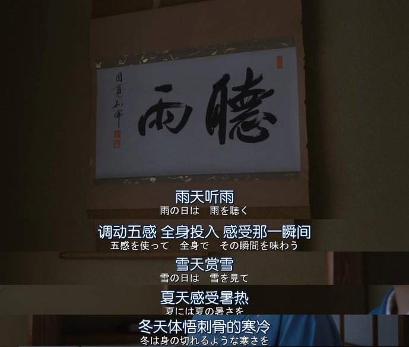

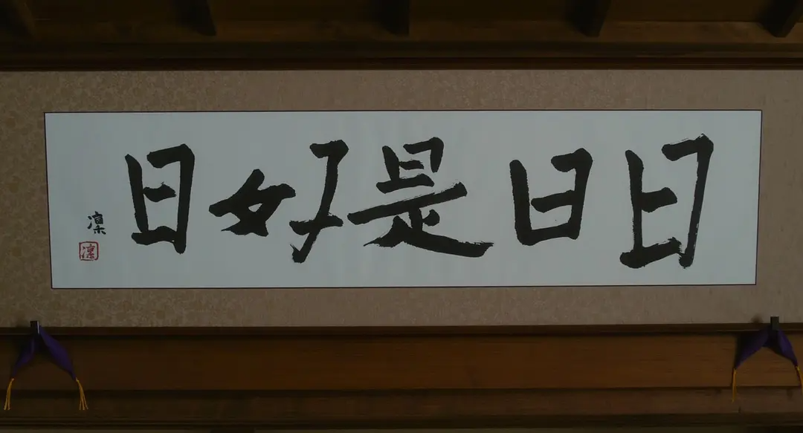

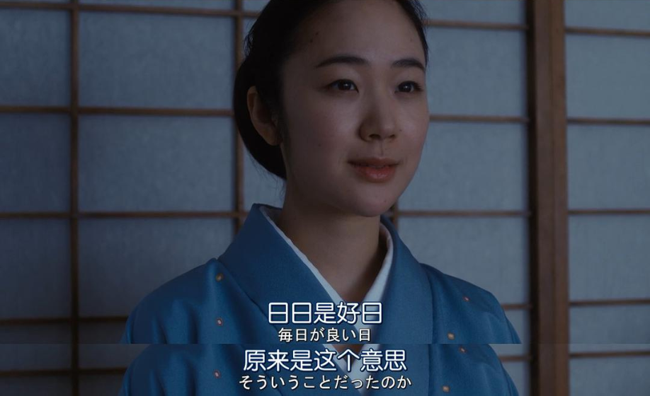

这部电影看完的感受，心会很平静。简单和缓地娓娓道来，却感受到滋养。

禅意雅致的茶室，像一个远离尘嚣的世外桃源。
茶壶，书画、清风、苔藓、流水、山涧……

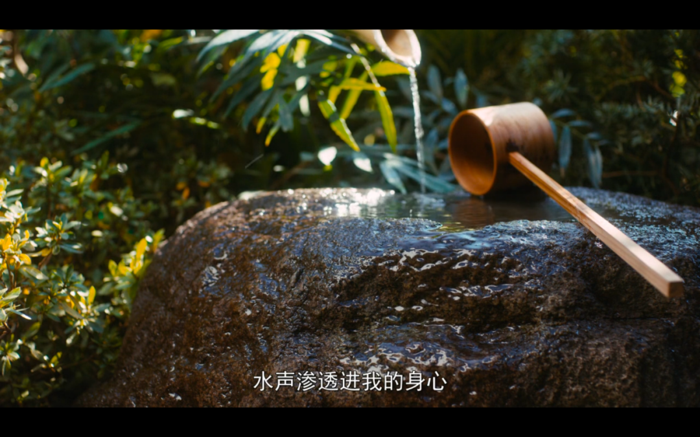

「水声渗进我的身心」，听见雷雨、风雨落在叶片的声音，有浸润感。

耳边有蝉鸣、鸟鸣。

茶烟袅袅，茶香涌出。唤起一颗敬畏心，一颗平常心。

冈仓天心在《茶之書》中说，日本茶道的繁文缛节，「是在我们都明白不可能完美的生命中，为了成就某种可能的完美，所进行的温柔试探。」[1]   

茶道，是在日常染污之间，因由对美的倾慕而建立起来的心灵仪式。

不仅是茶
更关乎心

春风送来了两位好奇少女，
拜师优雅智慧的武田老师。

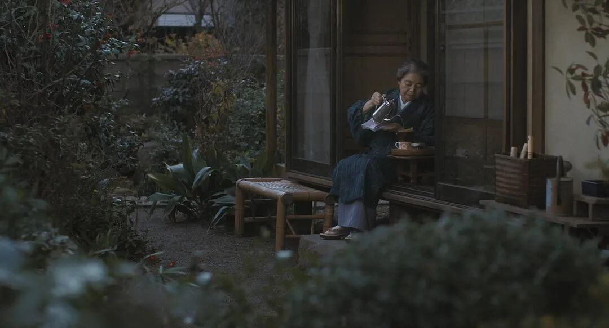

在学习茶道的最初，就告诉她们：

那些繁琐的工序，那些仪式感，不用去刻意背诵，而要去练习。待形式熟稔之后，会渗透进人的感知和习惯中。

放空大脑。相信身体。打开五感。用心去感受。

当纷乱的心智干扰被筛除掉，会打开灵魂的通道。感受是灵魂的语言，是你与世界的交流方式。

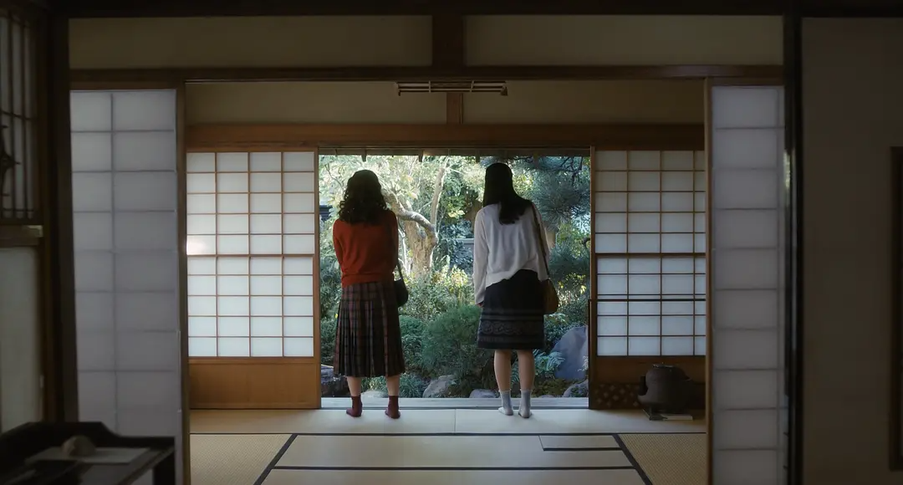

去觉察那些细微。只有代入自身去体悟，你才能辨别出：

热水流动，与冷水倒入的声音完全不同。热水呼噜噜，冷水淅沥沥。

梅雨的雨声，和夏日的雨声是不同的。

武田老师用自己的一言一行，用心对待每一个季节。茶室外四季流转的景色，茶室内墙上的字画也是不一样的。

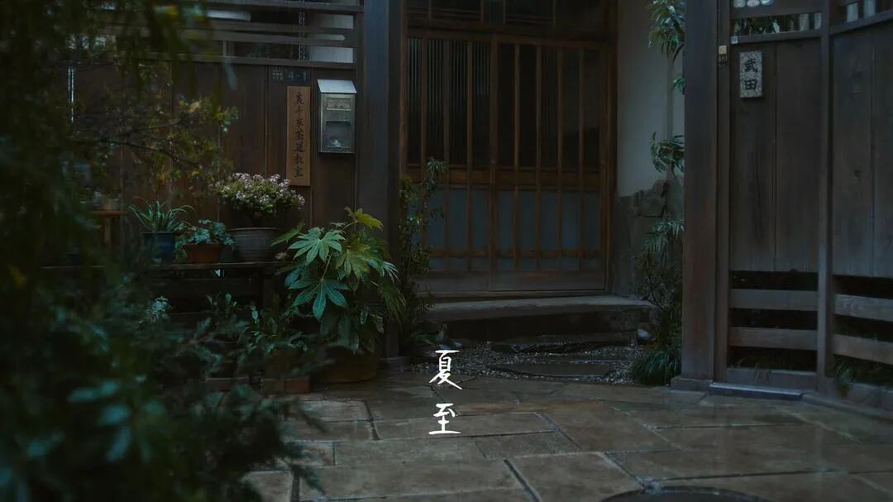

五月的晴天，是“熏风自南来”。

炎热的夏天，是“清流无间断”。

晚秋时节，是“双叶满林花”。

能量

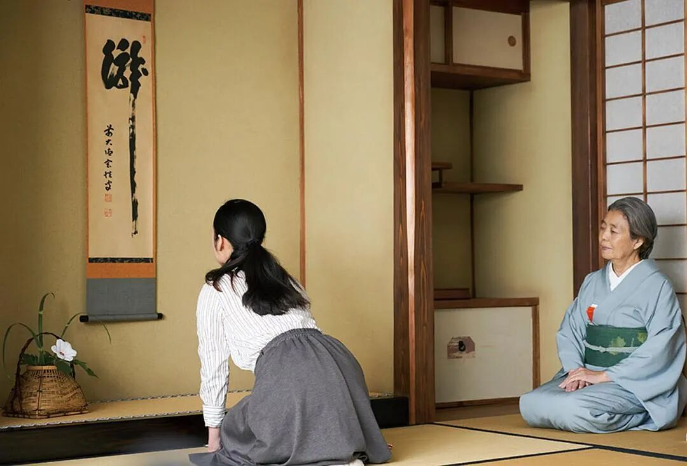

电影里的两个女主角，一个俏皮可爱，一个乖巧敏感，从未经世事，到经历人生不同阶段的惶恐无措。

从面临选择的焦躁不安，到午夜奔向静谧的茶室，心神不宁，变得心境宁静。似乎疲惫被擦拭而去。

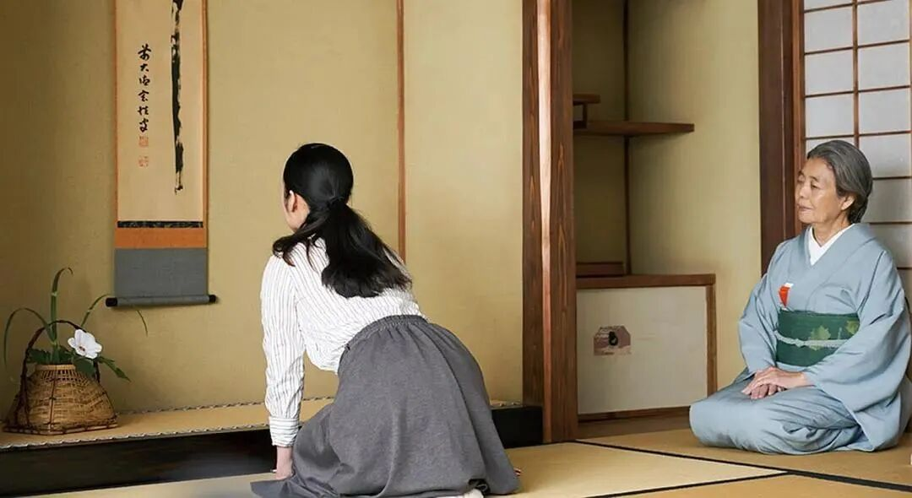

而作为电影的观看者，有一些句子，一些场景，会触碰到内心。不苦者有智。

内心有能量连接。唤起平常心。

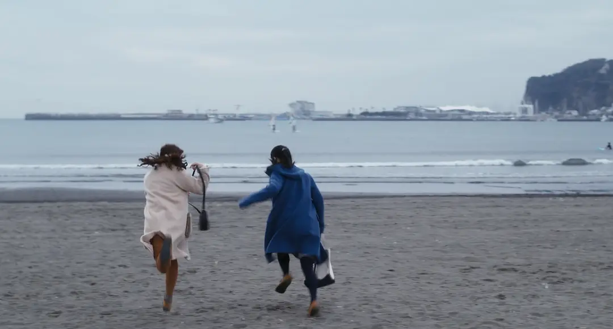

一期一会
待客之道

这是日本国宝级女星树木希林遗作。

她在其中饰演的武田老师，亲切、温暖、智慧。

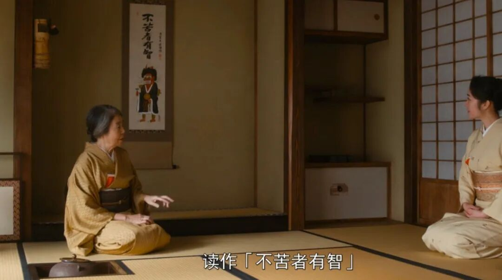

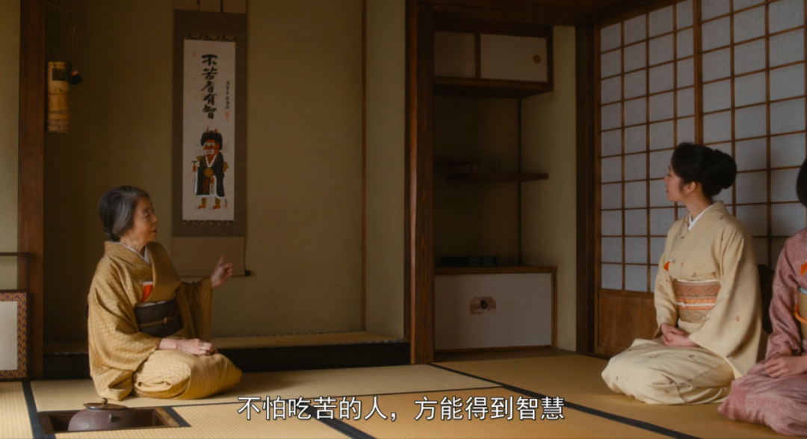

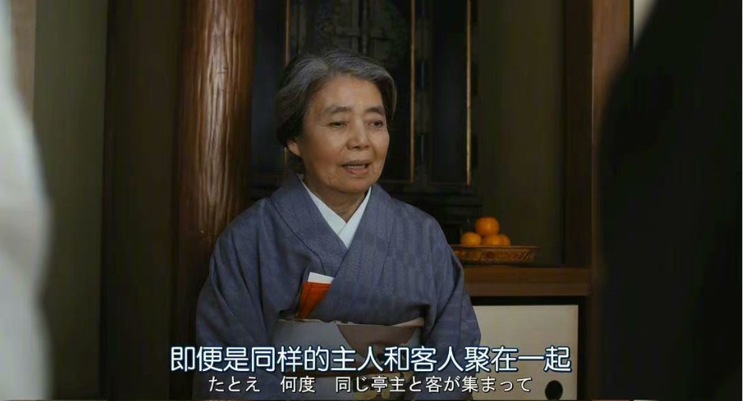

“茶会”被称为“一期一会”，意为一生中只有一次的茶会。

 所以大家都非常重视，倾尽心力来准备。

就算是相同的主人和相同的客人，也会因为心境、情境的不同，令每一次茶会的体验都不相同。

平常心

“日日是好日”，出自禅宗云门宗大师云门文偃之口，见《云门匡真禅师广录》。

喜欢的那句诗词，与其意境有异曲同工之妙。
“春有百花秋有月，夏有凉风冬有雪，若无闲事挂心头，便是人间好时节。”

春有百花，秋有圆月不错，夏有凉风，冬有雪景也很好；晴天时，则爱晴；雨天时，则爱雨；
有乐趣时，则快乐，没乐趣时，也快乐。只要有一颗平常心、 你能感受到的每一天，都是好日子。

日日是好日，每一天都有独特之美，经历过、感受过，才是真正活过。

当下

武田说，一年又一年，我们总是在同一天聚在一起，做着同样的事情。

之前觉得重复，现在觉得这是多么幸福的一件事啊。

而一件相同的事情，在不同的时节里也有变化。冬天有冬天煮茶的方法，夏天有夏天的。

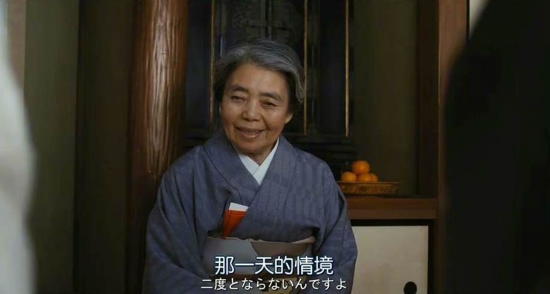

二十四节气对应的茶点也不同，可爱的点心是用应季的蔬果精制而成，让茶客能顺应气候，恰如其分地体验当下。

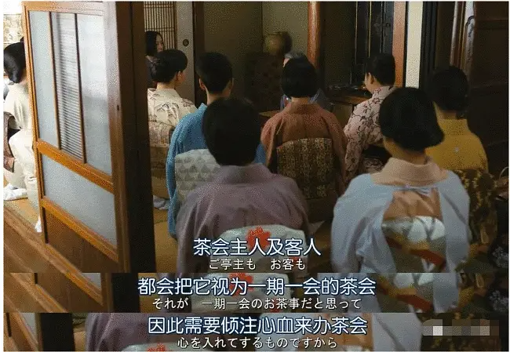

一辈子只能遇见三四次的茶盅。
匠人精工细作的微光。诉说着时光的故事和人的情感记忆。

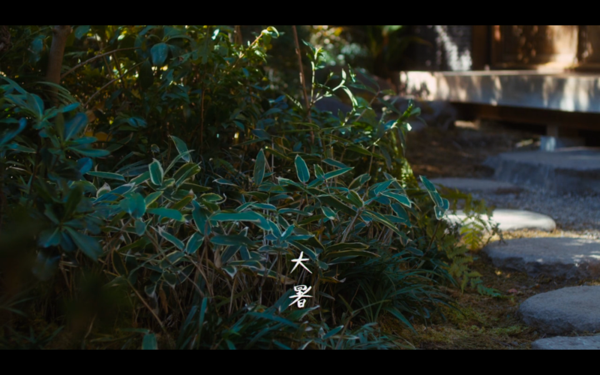

浸入此刻
相信时间

女主角典子每个周末去学习茶道，沉浸在宁静洗练的氛围中。

24年之后，感受过落樱、雨滴、飘雪……，觉知到时令、声音、光影的那种敏感。10岁时看不懂的电影《大路》，终于懂得。

而除了感恩生活，还有唤醒的灵魂。

当你的感官打开，即使面对茶室上的一副茶帛，也可以听见

「沸声如诉，如瀑布的磅礴回响，
被云朵挫钝；如远处海涛拍岸，激碎成浪花；
如滂沱大雨席卷竹林；
又如辽远山岗上松籁阵阵。」[2]

安安静静地听着屋檐的雨声，感知那些流淌着生活美学的泉源。

「也给我们这个日渐庸俗的世界打开一番新的境地，它带来更多宁静的时光，带来清澈的欢喜与秘密的诗意。」[3]

感官化的故事文旅

而当我们谈论感官的时候，我们在谈些什么？

「感官」是指人类的五感，视觉、听觉、嗅觉、味觉、触觉。还有你的第六感：感知整个世界的能力。

我们大部分人都是五感正常的人，但都曾是在城市里匆忙生活忙忙碌碌的行人，只顾着赶路，经历过感官变得钝感、麻木的遗憾。

也体会过在旅途中感官苏醒的怦然心动，与喜悦。

無舍正在致力于打造一条通往感知的道路。

我们除了一如既往用心做好民宿的质感，还想要成为感官化的故事文旅。会作为感官转换器，设计别样体验的旅居产品，打开感官。抵达内心深处的治愈。

下一篇，会跟大家分享無舍「感官之旅」的奇妙漫游。

期待在未来的相遇，当你推开無舍的门，你恢复感官的旅途，也就此开始了。

引用资料 References  
[1] [2] [3] 《茶之書》/ 冈仓天心  书摘
[4] 电影《日日是好日》主演：黑木华 / 树木希林 ……  

/ 编辑 / 耿悦
/ 设计 / Rexue

/ 图源 / 《日日是好日》剧照&截图、王能强、相游

infinihouses.com

△点击图片预订無舍

↓更多無舍故事↓
